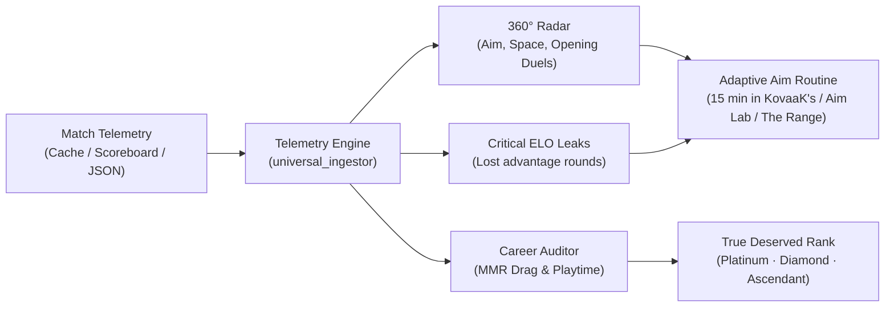

# Valorant Analytics

[](https://playvalorant.com/)
[](https://nodejs.org/)
[](package.json)
[](test_suite.js)
[](opencode_tester.js)
[](LICENSE)

**Competitive FPS telemetry, round diagnostics, and tactical coaching engine for Valorant.**  
Engineered to uncover where rounds slip away, eliminate recurring mechanical bad habits, and benchmark true rank progression beyond surface-level stats.

[Three Ways to Start](#-three-ways-to-get-started) • [Telemetry Matrix](#-the-problem-with-traditional-trackers) • [Diagnostic in Action](#-diagnostic-in-action) • [CLI Commands](#-essential-cli-commands) • [Technical Docs (SKILL.md)](SKILL.md) • [Versión en Español](README.es.md)

---

## ◈ The Problem with Traditional Trackers

Most public tracking platforms only report cumulative statistics: kills, deaths, overall headshot percentages, and win rates. While these describe the final scoreboard, they cannot explain **why** the match was lost.

| Dimension | Conventional Trackers | Valorant Analytics | ELO Progression Impact |
| :--- | :--- | :--- | :--- |
| **High-Impact Kills** | Counts all eliminations equally (flat K/D). | Separates meaningful damage (ADR) and openings ($FK/FD$) from exit frags in lost rounds. | Eliminates false security from chasing meaningless exit kills. |
| **Firing Mechanics** | Shows a single global headshot percentage. | Analyzes burst-to-tap ratios ($SE/TP$) across distance bands ($0-15\text{m}$, $15-30\text{m}$, $30-50\text{m}$). | Prevents long-range spray commitments and stabilizes first-shot accuracy. |
| **Duo Synergy** | Zero analytics on duo partner play. | Audits re-frag trade windows, damage balance, and role overlap. | Ensures you play synchronized with your partner rather than taking isolated 1v1s. |
| **Account Health** | Displays visual rank badge only. | Detects *MMR Drag* on aged accounts and calculates your True Deserved Rank. | Clarifies whether you are held back by skill gaps or Riot's algorithmic certainty. |
| **Reliability** | Frequent 403 outages due to Cloudflare Turnstile. | Native local Chromium cache crawler (Brotli/Gzip) with 100% offline mode. | Zero waiting: inspect private profiles and offline match dumps instantly. |

---

## ◈ Telemetry Pipeline Architecture

The engine parses round-level micro-events to turn raw match telemetry into actionable drills:



---

## ◈ Three Ways to Get Started

Designed to fit any player workflow, from instant conversational queries to terminal-based power users and autonomous agents:

### Option 1: Direct Web Mode (Zero Console)
Ideal for players who want immediate tactical advice without touching the command line.

1. Open the ready-to-use template: 👉 [**standalone_prompt.md**](standalone_prompt.md)
2. Copy its full contents and paste it into your favorite web assistant (**ChatGPT, Claude, Gemini, or DeepSeek**).
3. Provide your Tracker.gg match link or scoreboard text to receive a comprehensive diagnostic report.

### Option 2: Local Command Line (Master Dispatcher)
Ideal for competitive players and analysts seeking sub-100ms speed, total privacy, and offline processing.

```bash
# 1. Clone the repository
git clone https://github.com/Acourd/valorant-analytics.git
cd valorant-analytics

# 2. Diagnose your match locally in less than 100ms
node cli.js match examples/sample_match.json "PlayerName#TAG"
```

### Option 3: Autonomous Agent Mode (Antigravity / Claude Code / OpenCode)
For developers and power users integrating AI agent skills into their workflow:

- Mount the directory as an active skill via [`SKILL.md`](SKILL.md).
- Agents get access to 10 built-in commands with formal invariant verification and cryptographic attestations.

---

## ◈ Diagnostic in Action

Real-world output generated from competitive match telemetry:

```text
========================================================================
VALORANT ANALYTICS — TACTICAL TELEMETRY REPORT
Match: Lotus | Player: Iso | Lobby Tier: Platinum 2 / Diamond 1
========================================================================

COMPETITIVE PERFORMANCE RADAR:
  • First-Shot Precision      : [█████████░]  86 / 100  (28.5% Headshots)
  • Round Contribution (KAST) : [████████░░]  82 / 100  (74.0% useful rounds)
  • Opening Duels (FK/FD)     : [█████████░]  89 / 100  (54.0% First Bloods)
  • Economic Efficiency       : [█████████░]  90 / 100  (68.0% full-buy round winrate)
  • Clutch Composure          : [████████░░]  80 / 100  (33.3% conversion in 1v2s)

IDENTIFIED ELO LEAKS (WHERE YOU GAVE AWAY ADVANTAGES):
  [Leak 1] Over-peeking on post-plant (Rounds 7 & 14)
           Situation: 5v3 numerical advantage with spike already planted.
           Root:      Aggressive hunt for the final frag instead of crossfire setup.
           Fix:       Hold tight angles and force attackers to spend round clock.

  [Leak 2] Extended spraying beyond 30 meters (Rounds 11 & 18)
           Situation: Long-range rifle duels in A Main.
           Root:      Spray ratio elevated (SE/TP > 1.8) causing bullet bloom.
           Fix:       Switch to 2-bullet bursts paired with lateral counter-strafing.

PRESCRIBED AIM ROUTINE (15 MINUTES):
  ┌───────────────────────────┬──────────┬─────────────────────────────────────┐
  │ Drill Category            │ Duration │ Biomechanical Focus                 │
  ├───────────────────────────┼──────────┼─────────────────────────────────────┤
  │ 1. Microshot Static       │ 5 min    │ Head-level stopping calibration     │
  │ 2. Horizontal Click-Timing│ 5 min    │ Angle clearing on entry             │
  │ 3. Smooth Strafe Tracking │ 5 min    │ Tracking fast-moving targets        │
  └───────────────────────────┴──────────┴─────────────────────────────────────┘
========================================================================
```

---

## ◈ Essential CLI Commands

The unified dispatcher `cli.js` brings together all operations:

```bash
# Full match diagnostics and round leak detection
node cli.js match examples/sample_match.json "PlayerName#TAG"

# Generate tailored 15-minute aim routine
node cli.js aim examples/sample_match.json "PlayerName#TAG"

# Weapon telemetry and distance band breakdown (0-15m, 15-30m, 30-50m)
node cli.js weapons examples/sample_match.json "PlayerName#TAG"

# Audit coordination and re-frag trade windows with your premade duo
node cli.js duo examples/sample_match.json "Player1#TAG" "Player2#TAG"

# Harvest match payloads from local browser cache (bypasses Cloudflare)
node cli.js harvest

# Audit career hours and true in-match playtime
node cli.js career

# Assess true deserved rank and detect MMR Drag
node cli.js diagnose
```

---

## ◈ Privacy and Architecture

- **100% Local and Private:** All computation happens directly on your CPU. No match data, Riot IDs, or logs leave your machine.
- **Zero Dependencies:** Runs exclusively on standard Node.js built-ins (`fs`, `path`, `zlib`, `crypto`). Zero external npm packages.
- **Cross-Platform:** Fully supported and tested on Windows 11 (PowerShell), macOS (zsh/bash), and Linux.
- **Deterministic Reliability:** 46 automated assertions verified with Exit Code 0 and 100/100 code audit rating.

---

## ◈ License

Released under the [MIT License](LICENSE). Free for personal and competitive use.
