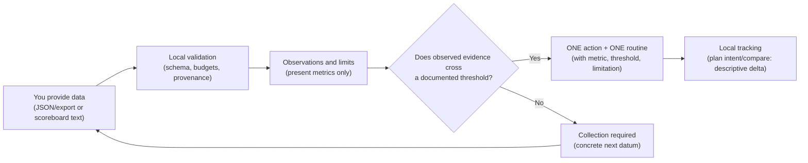

<div align="center">

# ⚡ VALORANT ANALYTICS

### Local Competitive Telemetry · 360° Descriptive Diagnostics · Adaptive Aim Engine

[](https://playvalorant.com/)
[](https://nodejs.org/)
[-38BDF8.svg?style=for-the-badge&logo=codeforces&logoColor=white)](package.json)
[](test_suite.js)
[](opencode_tester.js)
[](LICENSE)

<p align="center">
  <b>Local post-match self-analysis technical beta: it works with data you explicitly provide.</b><br>
  It produces descriptive observations with visible limits, one prioritized action (and its routine) only when observed evidence exists, and local tracking that compares compatible metrics. It does not measure internal MMR, talent, deserved rank, causality or improvement, and it does not replace a human coach.
</p>

[Three Ways to Start](#-three-ways-to-start) • [Status and value limits](#-current-status-and-value-limits) • [Comparison](#-the-problem-with-conventional-trackers) • [Real flow](#-analysis-flow-architecture) • [Import from Tracker](#-import-a-match-from-downloaded-text) • [Diagnostics in Action](#-diagnostics-in-action) • [CLI Commands](#-master-cli-command-guide) • [Gemini Gems & GPTs](#-gemini-gems--custom-gpts-support) • [Español](README.es.md)

</div>

---

## ◈ Current status and value limits

**What it is today:** a **local post-match self-analysis technical beta**. It works with **data you explicitly provide** (JSON/export or scoreboard text) and produces descriptive observations, visible limits and, only with observed evidence, one prioritized action with its routine. **It is not an automatic profile-import platform**: it does not query Tracker.gg or OP.GG, does not read browser cache, cookies or sessions, does not interpret screenshots (OCR not implemented) and does not access the Riot API. Riot RSO is an **optional future possibility** for authenticated telemetry, never a requirement or a feature available today.

| Input level | What to expect | What is NOT derived |
|---|---|---|
| Aggregates (scoreboard or summary stats) | Descriptive observations of present metrics and, if one crosses its documented threshold, **one** limited mechanical action with its routine | Causes, round conditions, tactical conclusions |
| Round events (normalized JSON) | Additional per-round observable metrics (damage, kills, economy) | Openings/trade reads without temporal marks |
| Timestamps, position or trade marks | Requirement for any opening or trade read | Nothing if missing: the limitation is declared |
| Insufficient data | Collection plan with the concrete next datum | Invented diagnosis, decorative scores |

**What it does not measure (unverified by design):** internal MMR, talent, deserved rank, causality or improvement; it **does not replace a human coach**. A variation across two matches is descriptive and may be noise.

---

## ◈ The Problem with Conventional Trackers

Most public web trackers only sum cumulative end-of-match stats: total kills, deaths, and a generic headshot percentage. This engine, with local data, works on the same aggregates: **without temporal-context events and a verified source, neither attributes tactical causes; both stay descriptive.**

| Analytical Dimension | Public Trackers | Valorant Analytics Engine | What it actually provides (with limits) |
| :--- | :---: | :---: | :--- |
| **Opening Kills/Deaths (FK/FD)** | 🔴 Flat K/D without context | 🟡 **Observed ADR + $FK/FD$ Ratio (aggregates)** | Counts observed FK (opening kills) and FD (opening deaths); with aggregates it separates no tactical causes or key kills. |
| **Gunfight Mechanics** | 🔴 Global headshot % | 🟢 **$SE/TP$ Ratio (observed zones)** | Measures over-spray from observed zones; distance is n/d without positions (never inferred). |
| **Duo Synergy** | 🔴 Non-existent | 🟢 **Duo Audit (aggregates)** | Describes kill/carry balance; it does NOT measure trade windows without temporal-context events. |
| **Round Economy** | 🔴 Total money spent | 🟢 **Conversion across Buy Tiers (Eco/Semi/Full)** | Describes buy-tier conversion with observed thresholds; it attributes no causes and projects no improvement. |
| **Account Health** | 🔴 Visual rank only | 🟡 **Heuristic MMR signal & rank estimate** | Raises an UNVERIFIED hypothesis of possible anchoring plus an indicative rank estimate. It does not measure Riot's internal MMR or real talent. |
| **Data Input** | 🔴 Cache harvesting / Tracker | 🟢 **JSON/export or text you provide** | No cache harvesting, no automatic downloads: you provide the input explicitly; the authorized route (Riot RSO) is pending credentials. |

---

## ◈ Analysis Flow Architecture

The real flow is local and evidence-gated (no Tracker, no cache, no screenshot OCR):



It does not query Tracker.gg or OP.GG, does not read browser cache, cookies or sessions, and does not interpret screenshots (OCR not implemented). Riot RSO is an **optional future possibility**, not a requirement or a feature available today.

---

## ◈ Three Ways to Start

Three manual-input paths; pick the one that adds the least friction to data you already have:

### 🔹 Option 1: Direct Mode without Terminal (Via Web AI or Gem)
> **Ideal if you want an immediate conversational analysis from a JSON/export or pasted scoreboard text (screenshot OCR: not implemented).**

1. Open the ready-to-use specification: 👉 [**`standalone_prompt.md`**](standalone_prompt.md)
2. Copy its entire content and paste it into your preferred AI assistant (**ChatGPT, Claude, Gemini, or DeepSeek-R1**), or configure it as a **Google Gemini Gem** or **OpenAI Custom GPT**.
3. Paste your scoreboard text or provide a JSON/export (screenshot OCR is NOT implemented; Tracker is not supported).

### ⚡ Option 2: Local Terminal Mode (Master Dispatcher `cli.js`)
> **100% local analysis with data you provide: JSON/export or scoreboard text. No automatic Tracker/OP.GG download, no browser cache and no screenshot OCR (not implemented).**

```bash
# 1. Clone the repository
git clone https://github.com/Acourd/valorant-analytics.git
cd valorant-analytics

# 2. PLAN for your next match (recommended flow: provide → understand → one action → re-measure)
node cli.js plan examples/sample_match.json "TenZ#0001"

# 3. Ingest your own scoreboard (JSON/export or text; no network)
node cli.js parse my_scoreboard.txt "TenZ#0001"

# 4. Broader reading and routine (only when the plan enables them)
node cli.js match examples/sample_match.json "TenZ#0001"
node cli.js aim examples/sample_match.json "TenZ#0001"

# 5. Technical integrity tools (not coaching): DSSE, Merkle, MPC, Wasm, invariants
node cli.js --advanced --help
```

### 🤖 Option 3: Autonomous Agent Mode (Antigravity / Claude Code / OpenCode)
> **For developers and advanced power users integrating agentic skills.**

- Mount the directory as an active skill via [`SKILL.md`](SKILL.md).
- Over 16 commands; cryptographic/integrity tools (DSSE, Merkle, invariants) are **technical verification**, not coaching, and live in advanced mode (`--advanced --help`).

---

## ◈ Diagnostics in Action

Illustrative example (local fixture; not real telemetry and not an empirically validated output):

```text
========================================================================
⚡ VALORANT ANALYTICS: UNIVERSAL SOVEREIGN ENGINE (V4.5)
========================================================================
🎯 DIAGNÓSTICO 360°: TenZ#0001 (Iso - Platinum 1) | Mapa: Lotus
------------------------------------------------------------------------
📊 RADAR DE RENDIMIENTO COMPETITIVO (5 PILARES):
  • Precisión Mecánica (HS%)  : [█████████░]  86 / 100  (29.9% Headshots | Benchmark: 25-35%)
  • Participación Útil (KAST) : [████████░░]  82 / 100  (74.0% de rondas útiles)
  • Apertura de Duelos (FK/FD): [█████████░]  94 / 100  (54.0% de First Bloods | 4 FK / 1 FD)
  • Disciplina Económica      : [█████████░]  90 / 100  (68.0% win en compra completa)
  • Compostura en Clutch      : [████████░░]  80 / 100  (33.3% conversión en situaciones 1v2)

🔎 PER-ROUND OBSERVATIONS (normalized data; NOT verified; NO causes are attributed):
  • R3 [damage] dmg 165 (H1/B2/L0)
  • R9 [economy] spent 2600
  (Leaks/causes omitted: they require a verified source + rule + outcome + context.)

📌 LIMITS OF THIS EXAMPLE: `normalized_input` provenance; no timestamps, position or trade marks,
   so no timing, trade or positioning rules are emitted.

🎯 SUGGESTED ROUTINE (only if observed evidence crosses its threshold; ~15 min, indicative):
  ┌───────────────────────────┬──────────┬──────────────────────┬─────────────────────────────────────┐
  │ Bloque de Entrenamiento   │ Duración │ Escenario KovaaK's   │ Objetivo Biomecánico                │
  ├───────────────────────────┼──────────┼──────────────────────┼─────────────────────────────────────┤
  │ 1. Calibración Primer Tiro│ 5 min    │ Pasu Small Reload    │ Calibración de parada en la cabeza  │
  │ 2. Limpieza de Ángulos    │ 5 min    │ 1wall6targets small  │ Confirmación de 1-tap en movimiento │
  │ 3. Control Horizontal     │ 5 min    │ Thin Aiming Long     │ Suavidad sin temblor en tracking    │
  └───────────────────────────┴──────────┴──────────────────────┴─────────────────────────────────────┘
========================================================================
```

---

## ◈ Master CLI Command Guide

The master dispatcher `cli.js` provides unified access to all platform engines:

| Command | Syntax | Description |
| :--- | :--- | :--- |
| **360° Diagnostics** | `node cli.js match [match.json] <player>` | Describes pillars from observed metrics; attributable leaks require a verified source. |
| **Aim Routine** | `node cli.js aim [match.json] <player>` | Proposes, only with observed evidence, an indicative ~15-minute aim playlist in KovaaK's / Aim Lab. |
| **Weapon Telemetry** | `node cli.js weapons [match.json] <player>` | Calculates observed hit zones (Head/Body/Leg) and SE/TP ratio; distance is n/d: never inferred without positions. |
| **Economy & Buy Tiers**| `node cli.js economy [match.json] <player>` | Breaks down win rate, K/D, and ADR across Pistol, Eco, Semi-Buy, and Full-Buy rounds. |
| **Introspective Coaching**| `node cli.js coaching [match.json] <player>` | Pinpoints high-friction duels and pairs errors with curated tactical YouTube drills. |
| **Duo Synergy Audit** | `node cli.js duo [match.json] [p1] [p2]` | Describes kill/carry balance (no timing windows; boost heuristic is unvalidated). |
| **1v1 Duel Matrix** | `node cli.js duels [match.json] [player]` | Analyzes direct head-to-head encounters against every opponent agent. |
| **Offline Simulation** | `node cli.js calibrate [player] [rank] [role]` | SIMULATION with illustrative values (no player data, no real telemetry). |
| **Career Audit** | `node cli.js career <profile.json>` | Breaks down competitive vs casual hours and generates rank milestones chronology. |
| **Heuristic MMR Signal** | `node cli.js diagnose <profile.json>` | Flags a pattern compatible with possible anchoring (UNVERIFIED hypothesis) and an indicative rank estimate. It does not measure internal MMR. |
| **Resilient Ingestion** | `node cli.js parse <file_or_text> [player]` | Parses JSON/export, text dumps or any existing file (extension optional). No network. |
| **Formal Invariants** | `node cli.js invariants [match.json] [player]` | Verifies mathematical bounds [0, 100] and hit-zone sum convergence (100%). |
| **Crypto Attestation**| `node cli.js attest [match.json] [player]` | Signs and verifies an Ed25519 in-toto DSSE attestation envelope. |
| **Merkle Tree** | `node cli.js merkle [match.json]` | Constructs discrete round Merkle trees and issues inclusion proofs. |
| **Session Guardian** | `node cli.js guardian [match.json] [player]` | Monitors cumulative neuromuscular fatigue and calculates cognitive tilt index. |
| **Tactical Drift** | `node cli.js drift [match.json] [player]` | Computes side divergence and Shannon entropy across round performance quarters. |
| **Multi-Lens Consensus**| `node cli.js consensus [match.json] [player]` | Deterministic arbitration across 3 local lenses (not real BFT) to deliver unified performance verdicts. |
| **CycloneDX SBOM** | `node cli.js sbom` | Exports an official CycloneDX v1.5 SBOM manifest with 0 external dependencies. |

---

## 🗂️ Local plan tracking (privacy and retention)

The full loop is local: **create plan → mark intent → provide another match → compare → next step**.

```bash
node cli.js plan my_scoreboard.txt "TenZ#0001"        # creates and registers the plan (deterministic planId)
node cli.js plan list                                  # active plans
node cli.js plan show <planId>                         # details: metric, threshold, action, routine, log
node cli.js plan intent <planId> "short note"          # marks the action as attempted (≤200 chars)
node cli.js plan compare <planId> another_match.txt    # honest comparison (comparable metrics only)
node cli.js plan close <planId> | cancel <planId>      # close or cancel
node cli.js plan export --pseudonymized                # explicit stdout export (pseudonymized player)
```

**Privacy and retention:** history lives in `VALORANT_PLANS_DIR` (default `<cache>/plans`): one JSON file per plan (0600 on POSIX, atomic writes) with player, input reference+digest, provenance, date, metric/value/threshold/limitation, action, routine, next datum, status and a short log. **No** credentials, tokens or third-party data are stored. **Directory perimeter** validated component by component (root included): no symlinks at any level, no non-directory paths, no foreign ownership, no group/other write (0770/0777 not admissible); the only exempt entries are direct children of the filesystem root (`/tmp`, `/var`…), which are system roots. Creation is stepwise, the final directory requires current-user ownership and 0700, and the chain is revalidated before the `rename`. Reads use a descriptor (`O_NOFOLLOW` where available) and verify identity and metadata (substitution ⇒ fail-closed); on Windows this is documented best-effort. 500-plan limit; `synthetic_demo` data is not persisted nor compared.

**Honest comparison:** requires the exact same player, an observed metric and compatible provenance. States: `MEDICION_COMPARABLE`, `DATOS_INSUFICIENTES`, `NO_COMPARABLE`, `SIMULACION_DEMO`; with `--json`, a single object. The result is a **descriptive delta** with an explicit limitation: a variation across two matches does not prove routine effect, improvement, MMR, rank or talent.

**Output profiles (same evidence, different presentation):** `--profile player` (default: match summary, measurement result under one of four labels —action available, no corrective action, insufficient data or demo simulation— and a single next step; no technical jargon or `planId`), `--profile coach` (evidence, limits and suggested questions) and `--profile analyst` (structured JSON with traceability). `--verbose` shows full detail in player and `--track` records tracking even without a corrective action (never in demo). They do not change the evidence policy.

## 🧱 Resource budgets and schema contract

Untrusted inputs are processed with **explicit limits**. `VA_BUDGET_*` (e.g. `VA_BUDGET_MAX_PLAYERS=32`) **can only REDUCE** a limit: invalid values (text, NaN, Infinity, non-integers, ≤0) or attempts to raise it above the compiled safe maximum **fail closed** with `RESOURCE_BUDGET_EXCEEDED`. There is no environment escape hatch to raise limits. Exceeding a limit fails closed with a stable code and **no partial analysis**:

| Budget | Default | Rationale |
|---|---|---|
| File size | 5 MiB | a normal export is <1 MiB; wide margin without OOM |
| Text length | 200,000 chars | a huge pasted scoreboard is tens of KB |
| JSON depth | 64 levels | `JSON.parse` does not limit depth |
| Players | 64 | a match has 10-20 |
| Rounds | 200 | a long competitive match is ~40 |
| Events | 100,000 | per-round aggregates of long matches |
| Items per array | 20,000 | real damage/kill lists |
| Processing time | 30 s | **cooperative cut** at instrumented phases and loops (`sample()`); the JS runtime cannot preempt synchronous code, so it is not a guaranteed hard cutoff |
| Concurrent workers | 16 | internal stress without saturating runners |

Codes: `INPUT_TOO_LARGE` (file/text), `SCHEMA_LIMIT_EXCEEDED` (depth, players, rounds, events, arrays), `RESOURCE_BUDGET_EXCEEDED` (time, workers). With `--json`, stdout is **one object**: `{ ok:false, exitCode, error:{ code, message, details } }`.

**Versioned schema:** `schemaVersion: 1` is the current contract. Canonical locations: `data.metadata.schemaVersion` (normalized) and `matchInfo.schemaVersion` (Riot). In Riot, a root `payload.schemaVersion` is accepted **only** if it matches the canonical one; if the canonical one is missing, a root-only version is **rejected** (`SCHEMA_UNSUPPORTED`), never admitted as `supported`. Absent ⇒ **legacy limited** (observable data is processed and the limitation declared); incompatible in any admitted location or **mismatch** ⇒ `SCHEMA_UNSUPPORTED`. Unknown fields are ignored safely and **declared in diagnostics**, never elevating provenance.

**Stress modality (outside the normal matrix):** `node tests/stress_dsse.js` runs bounded rounds of concurrent DSSE keystore registrations with the full invariant each round and no silent retries (the first error is logged). CI runs it in a separate job (`VA_STRESS_ROUNDS=3`).

## 📥 Minimum useful input (what you can provide)

You don't need impossible telemetry. The `plan` flow works by levels:

| Level | What you provide | What it enables |
|---|---|---|
| 1. Text/scoreboard | Pasted scoreboard text or a JSON/export with K/D/A, ACS, ADR and HS% | Descriptive observations and, if a metric crosses its documented threshold, **one** mechanical action with its routine |
| 2. Round events | `player-round` / `player-round-damage` segments | Observed head/body/leg zones and spray/tap ratio. Openings/trade reads additionally require trade, position or timestamp marks |
| 3. Verified source | Riot RSO with attestation (credentials pending) | The only path that could enable attributable causes/leaks; not available yet |

If your input is not enough, `plan` doesn't fail generically: it states the **smallest concrete next datum** (e.g. "HS% from the scoreboard" or "round events with trade marks").

## 📄 Import a match from downloaded text

You can also skip templates: save a match page as text and the local importer detects the format.

1. Open the match on Tracker in your browser.
2. Save the page as `.txt` (Ctrl+S → “Text only” / “Text page”).
3. Run the analysis with your exact Riot ID:

```bash
node cli.js plan  "tracker-match.txt" "Name#TAG"   # plan + local record
node cli.js parse "tracker-match.txt" "Name#TAG"   # descriptive ingest
node cli.js match "tracker-match.txt" "Name#TAG"   # 360° diagnostic
```

- **Manual text origin only:** you provide the file. The product **does not sign in, does not query Tracker, does not read browser cache and does not bypass Cloudflare**; it performs no scraping and uses no Tracker APIs.
- **Explicit detection with fail-closed behavior:** if the `Scoreboard` block is incomplete or the format changed, it ends with `TRACKER_TEXT_FORMAT_UNSUPPORTED` and does **not** fall back to the generic parser or emit partial analysis.
- **Extracts only what is observed** (agent, rank, ACS, K/D/A, +/-, K/D, DDΔ, ADR, HS%, KAST, FK, FD, MK, map, mode, score, date, duration and average rank) and leaves absent data as `null` + declared; it invents no rounds, positions, economy, trades, duels or events.
- **Provenance `normalized_input`** with a local digest of the text, never `verified_source`. The same limits apply: it attributes no causes, measures no internal MMR/talent/deserved rank and demonstrates no improvement.
- With `--json`, the output reports `sourceFormat: tracker_text_export`, extracted/missing fields and declared limits.

## ◈ Gemini Gems & Custom GPTs Support

If you use **Google Gemini (Gems)** or **OpenAI (Custom GPTs)**, [`standalone_prompt.md`](standalone_prompt.md) (Spanish) and [`standalone_prompt.en.md`](standalone_prompt.en.md) (English) are optimized to work only with data you provide (JSON/export, text or a saved Tracker `.txt`):

- **System prompt with XML tags** (`<system_role>`, `<vision_and_input_protocol>`, `<output_specification>`) and anti-hallucination guardrails.
- **Local multi-format ingest:** JSON/export, scoreboard text or a saved Tracker `.txt`; screenshot OCR not implemented. Full Spanish version: [`standalone_prompt.md`](standalone_prompt.md).

---

## ◈ Privacy & Engineering Specifications

- **100% Local & Confidential:** all analysis runs on your machine; nothing leaves it. No network calls unless you later enable Riot RSO with your own credentials.
- **No network by default:** analysis is local. No browser cache harvesting and no Tracker.gg queries. Input is a JSON/export, scoreboard text or a `.txt` manually saved from Tracker (manual text origin: no sign-in, no scraping, no automatic integration); screenshot OCR is not implemented.
- **Zero NPM Dependencies:** Built strictly on native Node.js core libraries (`fs`, `path`, `zlib`, `crypto`, `child_process`). Zero external downloads.
- **Cross-Platform Compatibility:** Tested in CI on Windows, macOS and Linux (Node 18/20/22/24); no result guarantee.
- **Deterministic Reliability:** 222 automated tests plus modular suites passing with Exit Code 0 (`node run_all_tests.js`) and a semantic fail-closed property audit, with no promotional score (`node opencode_tester.js`).
- **CLI Contract:** human and `--json` output; documented exit codes `0`/`1`/`2` (valid result / invalid input / insufficient evidence); no command silently picks a player.

---

## ◈ Scope & Limits (Data Honesty)

This project **describes** what local telemetry allows you to observe; it does not certify facts about Riot's internal matchmaking or about the player.

- **MMR / "MMR Drag":** the output is an **unverified heuristic hypothesis** derived from aggregates (matches, KD, ACS, DDΔ, HS, hours). The project does **not** access internal MMR or per-match RR gains/losses, so it cannot determine or prove algorithmic anchoring. Every such conclusion is tagged `hipotesis_no_verificada`.
- **Talent vs effort:** a **descriptive label** for impact/volume patterns, not a measurement of talent. Aggregates do not separate talent from effort and prove no causality.
- **Deserved rank:** the "rank estimate" is an **indicative bound** derived from heuristic thresholds, not a real rank.
- **Validation pending:** the engine has not yet been validated against real telemetry or a player sample. Until then, no output should be presented as a conclusive diagnosis.
- **`verified_source` (front #1):** the only authorized source for VALORANT is the **official Riot API (production key + Riot Sign-On)**; personal/developer keys have no access. The adapter (`scripts/riot_source.js`) requires a Riot token, an allowlisted host, a verifiable `matchId`, and an Ed25519 attestation **checked against the operator trust store** (`RIOT_ATTESTATION_TRUST`), which is **never accepted as an argument**; the signature comes from the **authorized ingestor's** private key (`RIOT_ATTESTATION_KEY`, 0600 outside the repo), never a caller key. A local signature attests **ingestor provenance**, not that Riot cryptographically emitted the content. Without approved credentials, `verified_source` is unreachable and everything stays `normalized_input`. Riot credentials: **pending request**.
- **ELO leaks (360° learning):** they are only emitted as attributable with a verified source; with local data they show descriptive observations, not a forensic audit of the account.

---

## ◈ License

Distributed under the [MIT License](LICENSE). Free and open source for personal, competitive, and pedagogical use.
