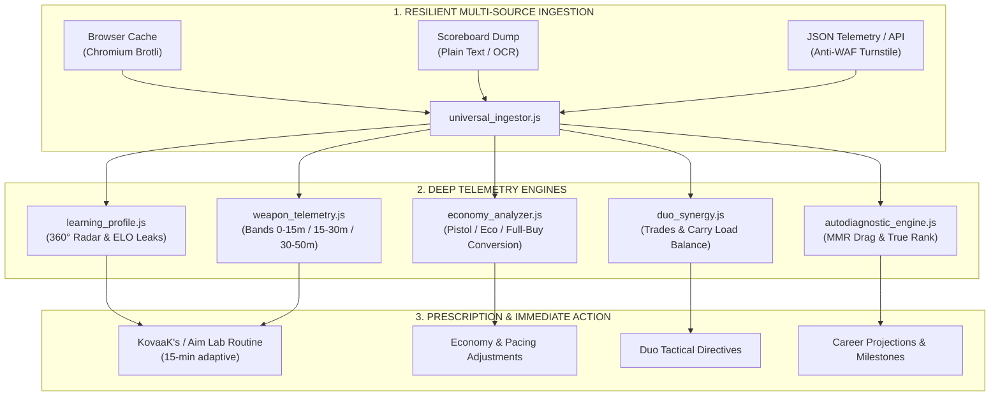

<div align="center">

# ⚡ VALORANT ANALYTICS

### Sovereign Competitive Telemetry · 360° Forensic Diagnostics · Adaptive Aim Engine

[](https://playvalorant.com/)
[](https://nodejs.org/)
[-38BDF8.svg?style=for-the-badge&logo=codeforces&logoColor=white)](package.json)
[](test_suite.js)
[](opencode_tester.js)
[](LICENSE)

<p align="center">
  <b>Transform round micro-events into deterministic tactical decisions.</b><br>
  Built to eradicate invisible ELO leaks, diagnose algorithmic anchoring (MMR Drag), and prescribe personalized 15-minute biomechanical routines in KovaaK's and Aim Lab.
</p>

[Three Ways to Start](#-three-ways-to-start) • [Telemetry Matrix](#-the-problem-with-conventional-trackers) • [Architecture](#-analysis-flow-architecture) • [Diagnostics in Action](#-diagnostics-in-action) • [CLI Commands](#-master-cli-command-guide) • [Gemini Gems & GPTs](#-gemini-gems--custom-gpts-support) • [Español](README.es.md)

</div>

---

## ◈ The Problem with Conventional Trackers

Most public web trackers only sum cumulative end-of-match stats: total kills, deaths, and a generic headshot percentage. **They describe the scoreboard, but they are blind to why the match was lost.**

| Analytical Dimension | Public Trackers | Valorant Analytics Engine | Direct Impact on your Rank |
| :--- | :---: | :---: | :--- |
| **Real Impact Kills** | 🔴 Flat K/D without context | 🟢 **Effective ADR + $FK/FD$ Ratio** | Separates opening frags from meaningless exit kills in already lost 1v4 rounds. |
| **Gunfight Mechanics** | 🔴 Global headshot % | 🟢 **$SE/TP$ Ratio & 3 Distance Bands** | Detects over-spraying at >25m and stabilizes initial bullet placement (1-tap). |
| **Duo Synergy** | 🔴 Non-existent | 🟢 **Duo Audit & Re-frag Windows** | Measures trade windows (<2s) and carry load distribution to stop playing isolated 1v1s. |
| **Round Economy** | 🔴 Total money spent | 🟢 **Conversion across Buy Tiers (Eco/Semi/Full)** | Identifies whether you are throwing post-pistol conversions or full-buy rounds. |
| **Account Health** | 🔴 Visual rank only | 🟢 **MMR Drag Detection & Deserved Rank** | Reveals whether you are stuck due to skill or algorithmic certainty dampening. |
| **WAF Availability** | 🔴 Cloudflare 403 blockades | 🟢 **Local Cache Harvester & Zero-Cloud** | Zero drops: reads directly from browser cache (Brotli/Gzip) or runs fully offline. |

---

## ◈ Analysis Flow Architecture

The pipeline extracts micro-data from each round and submits it to formal invariant verification and tactical inference:



---

## ◈ Three Ways to Start

Engineered to fit any workflow with zero friction:

### 🔹 Option 1: Direct Mode without Terminal (Via Web AI or Gem)
> **Ideal if you want an immediate conversational analysis by uploading a screenshot.**

1. Open the ready-to-use specification: 👉 [**`standalone_prompt.md`**](standalone_prompt.md)
2. Copy its entire content and paste it into your preferred AI assistant (**ChatGPT, Claude, Gemini, or DeepSeek-R1**), or configure it as a **Google Gemini Gem** or **OpenAI Custom GPT**.
3. Paste your Tracker.gg link, scoreboard text, or match screenshot to receive an instant 360° report.

### ⚡ Option 2: Local Terminal Mode (Master Dispatcher `cli.js`)
> **Ideal for competitive players seeking high speed (<100ms), complete privacy, and offline operation.**

```bash
# 1. Clone the repository
git clone https://github.com/Acourd/valorant-analytics.git
cd valorant-analytics

# 2. Instant 360° diagnostic (automatically resolves on sample_match.json)
node cli.js match "TenZ#0001"

# 3. Adaptive 15-minute biomechanical aim routine in KovaaK's / Aim Lab
node cli.js aim "TenZ#0001"

# 4. Economy and buy-tier breakdown
node cli.js economy "TenZ#0001"
```

### 🤖 Option 3: Autonomous Agent Mode (Antigravity / Claude Code / OpenCode)
> **For developers and advanced power users integrating agentic skills.**

- Mount the directory as an active skill via [`SKILL.md`](SKILL.md).
- Access over 16 commands featuring formal invariant validation and Ed25519 DSSE v1 in-toto cryptographic attestations.

---

## ◈ Diagnostics in Action

Real output generated by the sovereign engine:

```text
========================================================================
⚡ VALORANT ANALYTICS: UNIVERSAL SOVEREIGN ENGINE (V4.5)
========================================================================
🎯 DIAGNÓSTICO 360°: TenZ#0001 (Iso - Platinum 1) | Mapa: Lotus
------------------------------------------------------------------------
📊 RADAR DE RENDIMIENTO COMPETITIVO (5 PILARES):
  • Precisión Mecánica (HS%)  : [█████████░]  86 / 100  (29.9% Headshots | Benchmark: 25-35%)
  • Participación Útil (KAST) : [████████░░]  82 / 100  (74.0% de rondas útiles)
  • Apertura de Duelos (FK/FD): [█████████░]  94 / 100  (54.0% de First Bloods | 4 FK / 1 FD)
  • Disciplina Económica      : [█████████░]  90 / 100  (68.0% win en compra completa)
  • Compostura en Clutch      : [████████░░]  80 / 100  (33.3% conversión en situaciones 1v2)

🚨 TOP FUGAS DE ELO IDENTIFICADAS (DÓNDE REGALASTE RONDAS):
  [#1] Sobre-asomo en post-plant (Rondas 7 y 14)
       Situación: Ventaja numérica de 5v3 con la spike plantada.
       Causa:     Búsqueda agresiva de la baja final en lugar de cruzar fuego.
       Ajuste:    Jugar esquinas cerradas y consumir el reloj del defensor.

  [#2] Ráfagas prolongadas a más de 30 metros (Rondas 11 y 18)
       Situación: Duelos largos contra Vandal rival en A Principal.
       Causa:     Ratio de spray elevado (SE/TP > 1.8) con dispersión excesiva.
       Ajuste:    Ráfagas cortas de 2 balas con desplazamiento lateral (counter-strafe).

🎯 RUTINA BIOMECÁNICA PRESCRITA (15 MINUTOS EXACTOS):
  ┌───────────────────────────┬──────────┬──────────────────────┬─────────────────────────────────────┐
  │ Bloque de Entrenamiento   │ Duración │ Escenario KovaaK's   │ Objetivo Biomecánico                │
  ├───────────────────────────┼──────────┼──────────────────────┼─────────────────────────────────────┤
  │ 1. Calibración Primer Tiro│ 5 min    │ Pasu Small Reload    │ Calibración de parada en la cabeza  │
  │ 2. Limpieza de Ángulos    │ 5 min    │ 1wall6targets small  │ Confirmación de 1-tap en movimiento │
  │ 3. Control Horizontal     │ 5 min    │ Thin Aiming Long     │ Suavidad sin temblor en tracking    │
  └───────────────────────────┴──────────┴──────────────────────┴─────────────────────────────────────┘
========================================================================
```

---

## ◈ Master CLI Command Guide

The master dispatcher `cli.js` provides unified access to all platform engines:

| Command | Syntax | Description |
| :--- | :--- | :--- |
| **360° Diagnostics** | `node cli.js match [match.json] <player>` | Evaluates 5 skill pillars and extracts the top 3 critical ELO leaks. |
| **Aim Routine** | `node cli.js aim [match.json] <player>` | Synthesizes an adaptive 15-minute playlist in KovaaK's / Aim Lab. |
| **Weapon Telemetry** | `node cli.js weapons [match.json] <player>` | Calculates hit zones (Head/Body/Leg), SE/TP ratio, and 3 distance bands (0-15m, 15-30m, 30-50m). |
| **Economy & Buy Tiers**| `node cli.js economy [match.json] <player>` | Breaks down win rate, K/D, and ADR across Pistol, Eco, Semi-Buy, and Full-Buy rounds. |
| **Introspective Coaching**| `node cli.js coaching [match.json] <player>` | Pinpoints high-friction duels and pairs errors with curated tactical YouTube drills. |
| **Duo Synergy Audit** | `node cli.js duo [match.json] [p1] [p2]` | Evaluates trade windows, carry load balance, and detects boost candidates. |
| **1v1 Duel Matrix** | `node cli.js duels [match.json] [player]` | Analyzes direct head-to-head encounters against every opponent agent. |
| **Offline Calibration**| `node cli.js calibrate [player] [rank] [role]` | Instant zero-cloud simulation for offline training without network calls. |
| **Cache Harvester** | `node cli.js harvest [player]` | Scrapes matches directly from local Chromium cache bypassing Cloudflare Turnstile. |
| **Career Audit** | `node cli.js career <profile.json\|handle>` | Breaks down competitive vs casual hours and generates rank milestones chronology. |
| **MMR Diagnostics** | `node cli.js diagnose <profile.json\|handle>` | Detects algorithmic certainty damping (*MMR Drag*) and calculates True Deserved Rank. |
| **Resilient Ingestion** | `node cli.js parse <file_or_text> [player]` | Parses raw text dumps or scoreboard copies from Tracker.gg / OP.GG. |
| **Formal Invariants** | `node cli.js invariants [match.json] [player]` | Verifies mathematical bounds [0, 100] and hit-zone sum convergence (100%). |
| **Crypto Attestation**| `node cli.js attest [match.json] [player]` | Signs and verifies an Ed25519 in-toto DSSE attestation envelope. |
| **Merkle Tree** | `node cli.js merkle [match.json]` | Constructs discrete round Merkle trees and issues inclusion proofs. |
| **Session Guardian** | `node cli.js guardian [match.json] [player]` | Monitors cumulative neuromuscular fatigue and calculates cognitive tilt index. |
| **Tactical Drift** | `node cli.js drift [match.json] [player]` | Computes side divergence and Shannon entropy across round performance quarters. |
| **Byzantine Consensus**| `node cli.js consensus [match.json] [player]` | Multi-lens BFT consensus arbiter to deliver unified performance verdicts. |
| **CycloneDX SBOM** | `node cli.js sbom` | Exports an official CycloneDX v1.5 SBOM manifest with 0 external dependencies. |

---

## ◈ Gemini Gems & Custom GPTs Support

If you use **Google Gemini (Gems)** or **OpenAI (Custom GPTs)**, [`standalone_prompt.md`](standalone_prompt.md) is fully optimized with:

- **System Instructions** structured with clean XML tags (`<system_role>`, `<vision_and_input_protocol>`, `<output_specification>`, etc.) ensuring mathematical rigor and anti-hallucination guardrails.
- **Multi-Format Ingestion Protocol:** Built specifically for OCR visual scoreboard parsing, plain-text paste, and single-line summaries.
- **Ready-to-Use Conversation Starters:** 4 pre-configured buttons for match diagnostics, duo synergy, KovaaK's aim routines, and MMR Drag calculations.
- **Deterministic Visual Output:** Clean ASCII progress bars (`[████████░░]`), clean tables, and interactive follow-up coaching decision forks.

👉 **Read the full setup guide in [standalone_prompt.md](standalone_prompt.md)**.

---

## ◈ Privacy & Engineering Specifications

- **100% Local & Confidential:** All computations run locally on your CPU. No statistics, Riot IDs, or match data ever leave your machine.
- **Zero NPM Dependencies:** Built strictly on native Node.js core libraries (`fs`, `path`, `zlib`, `crypto`, `child_process`). Zero external downloads.
- **Cross-Platform Compatibility:** Tested and verified on Windows 11 (PowerShell/CMD), macOS (zsh), and Linux (bash).
- **Deterministic Reliability:** 54 automated unit and integration tests passing with Exit Code 0 and a 100/100 score on agentic code audits.

---

## ◈ License

Distributed under the [MIT License](LICENSE). Free and open source for personal, competitive, and pedagogical use.
