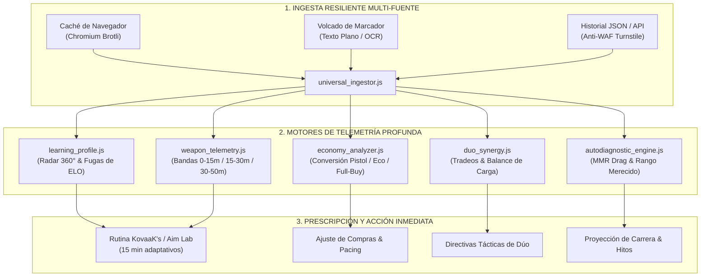

<div align="center">

# ⚡ VALORANT ANALYTICS

### Telemetría Competitiva Soberana · Diagnóstico Forense 360° · Motor de Puntería Adaptativo

[](https://playvalorant.com/)
[](https://nodejs.org/)
[-38BDF8.svg?style=for-the-badge&logo=codeforces&logoColor=white)](package.json)
[](test_suite.js)
[](opencode_tester.js)
[](LICENSE)

<p align="center">
  <b>Transforma micro-eventos de ronda en decisiones tácticas deterministas.</b><br>
  Diseñado para erradicar las fugas invisibles de ELO, diagnosticar el anclaje algorítmico (MMR Drag) y prescribir rutinas biomecánicas personalizadas de 15 minutos en KovaaK's y Aim Lab.
</p>

[Tres Formas de Empezar](#-tres-formas-de-empezar) • [Matriz de Telemetría](#-el-problema-con-los-rastreadores-convencionales) • [Arquitectura](#-arquitectura-del-flujo-de-análisis) • [Diagnóstico en Acción](#-diagnóstico-en-acción) • [Comandos CLI](#-guía-de-comandos-principales) • [Gemini Gems & GPTs](#-soporte-para-gemini-gems-y-custom-gpts) • [English](README.en.md)

</div>

---

## ◈ El Problema con los Rastreadores Convencionales

La mayoría de rastreadores web públicos solo suman cifras acumuladas al final de la partida: bajas totales, muertes y un porcentaje genérico de tiros a la cabeza. **Describen el marcador, pero son ciegos ante el por qué se perdió la partida.**

| Dimensión Analítica | Rastreadores Públicos | Motor Valorant Analytics | Impacto Directo en tu Rango |
| :--- | :---: | :---: | :--- |
| **Bajas de Impacto Real** | 🔴 K/D plano sin contexto | 🟢 **ADR útil + Ratio $FK/FD$** | Diferencia bajas clave de apertura de rondas basura en desventajas 1v4 ya perdidas. |
| **Mecánica de Disparo** | 🔴 % Headshot global | 🟢 **Ratio $SE/TP$ & 3 Bandas de Distancia** | Detecta sobre-spray prolongado a más de 25m y estabiliza el primer impacto (1-tap). |
| **Sinergia en Pareja** | 🔴 Inexistente | 🟢 **Auditoría de Dúo & Ventanas de Re-frag** | Mide tiempos de tradeo (<2s) y balance de carga para evitar jugar dos 1v1 aislados. |
| **Economía de Rondas** | 🔴 Total gastado global | 🟢 **Conversión por Buy-Tiers (Eco/Semi/Full)** | Identifica si estás regalando rondas clave tras ganar pistolas o en compras completas. |
| **Salud de Cuenta** | 🔴 Solo rango visual | 🟢 **Detección de *MMR Drag* & Rango Merecido** | Revela si estás estancado por habilidad o por el anclaje de certeza del algoritmo de Riot. |
| **Disponibilidad WAF** | 🔴 Caídas por Cloudflare 403 | 🟢 **Cosecha Local de Caché & Modo Zero-Cloud** | Cero bloqueos: lee directamente del navegador (Brotli/Gzip) o analiza sin conexión. |

---

## ◈ Arquitectura del Flujo de Análisis

El pipeline extrae micro-datos de cada ronda y los somete a verificación formal e inferencia táctica:



---

## ◈ Tres Formas de Empezar

Diseñado para adaptarse a cualquier flujo de trabajo sin fricciones:

### 🔹 Opción 1: Modo Directo sin Terminal (Vía Asistente Web o Gem)
> **Ideal si buscas un análisis conversacional inmediato subiendo una captura de pantalla.**

1. Abre la especificación lista para usar: 👉 [**`standalone_prompt.md`**](standalone_prompt.md)
2. Copia todo su contenido y pégalo en tu asistente de IA favorito (**ChatGPT, Claude, Gemini o DeepSeek-R1**), o configúralo como un **Gem de Google Gemini** o **Custom GPT de OpenAI**.
3. Pega el enlace de Tracker.gg, el texto de tu marcador o una captura de pantalla para recibir el reporte 360° instantáneo.

### ⚡ Opción 2: Modo Local en Terminal (Despachador Maestro `cli.js`)
> **Ideal para jugadores competitivos que buscan velocidad (<100ms), privacidad total y funcionamiento sin red.**

```bash
# 1. Clona el repositorio
git clone https://github.com/Acourd/valorant-analytics.git
cd valorant-analytics

# 2. Diagnóstico 360° inmediato (resuelve sobre sample_match.json automáticamente)
node cli.js match "TenZ#0001"

# 3. Rutina biomecánica adaptativa de 15 minutos en KovaaK's / Aim Lab
node cli.js aim "TenZ#0001"

# 4. Auditoría de economía y buy-tiers
node cli.js economy "TenZ#0001"
```

### 🤖 Opción 3: Modo Agente Autónomo (Antigravity / Claude Code / OpenCode)
> **Para desarrolladores y usuarios avanzados que integran habilidades agénticas.**

- Carga la carpeta como skill activa enlazando [`SKILL.md`](SKILL.md).
- Dispondrás de más de 16 comandos con verificación formal de invariantes matemáticos y atestaciones criptográficas in-toto DSSE v1.

---

## ◈ Diagnóstico en Acción

Ejemplo real generado a partir de telemetría procesada por el motor soberano:

```text
========================================================================
⚡ VALORANT ANALYTICS: UNIVERSAL SOVEREIGN ENGINE (V4.5)
========================================================================
🎯 DIAGNÓSTICO 360°: TenZ#0001 (Iso - Platinum 1) | Mapa: Lotus
------------------------------------------------------------------------
📊 RADAR DE RENDIMIENTO COMPETITIVO (5 PILARES):
  • Precisión Mecánica (HS%)  : [█████████░]  86 / 100  (29.9% Headshots | Benchmark: 25-35%)
  • Participación Útil (KAST) : [████████░░]  82 / 100  (74.0% de rondas útiles)
  • Apertura de Duelos (FK/FD): [█████████░]  94 / 100  (54.0% de First Bloods | 4 FK / 1 FD)
  • Disciplina Económica      : [█████████░]  90 / 100  (68.0% win en compra completa)
  • Compostura en Clutch      : [████████░░]  80 / 100  (33.3% conversión en situaciones 1v2)

🚨 TOP FUGAS DE ELO IDENTIFICADAS (DÓNDE REGALASTE RONDAS):
  [#1] Sobre-asomo en post-plant (Rondas 7 y 14)
       Situación: Ventaja numérica de 5v3 con la spike plantada.
       Causa:     Búsqueda agresiva de la baja final en lugar de cruzar fuego.
       Ajuste:    Jugar esquinas cerradas y consumir el reloj del defensor.

  [#2] Ráfagas prolongadas a más de 30 metros (Rondas 11 y 18)
       Situación: Duelos largos contra Vandal rival en A Principal.
       Causa:     Ratio de spray elevado (SE/TP > 1.8) con dispersión excesiva.
       Ajuste:    Ráfagas cortas de 2 balas con desplazamiento lateral (counter-strafe).

🎯 RUTINA BIOMECÁNICA PRESCRITA (15 MINUTOS EXACTOS):
  ┌───────────────────────────┬──────────┬──────────────────────┬─────────────────────────────────────┐
  │ Bloque de Entrenamiento   │ Duración │ Escenario KovaaK's   │ Objetivo Biomecánico                │
  ├───────────────────────────┼──────────┼──────────────────────┼─────────────────────────────────────┤
  │ 1. Calibración Primer Tiro│ 5 min    │ Pasu Small Reload    │ Calibración de parada en la cabeza  │
  │ 2. Limpieza de Ángulos    │ 5 min    │ 1wall6targets small  │ Confirmación de 1-tap en movimiento │
  │ 3. Control Horizontal     │ 5 min    │ Thin Aiming Long     │ Suavidad sin temblor en tracking    │
  └───────────────────────────┴──────────┴──────────────────────┴─────────────────────────────────────┘
========================================================================
```

---

## ◈ Guía de Comandos Principales

El despachador maestro `cli.js` provee acceso unificado a todas las capacidades del sistema:

| Comando | Sintaxis | Descripción |
| :--- | :--- | :--- |
| **Diagnóstico 360°** | `node cli.js match [partida.json] <jugador>` | Evalúa los 5 pilares de rendimiento y extrae las 3 fugas críticas de ELO. |
| **Rutina de Puntería** | `node cli.js aim [partida.json] <jugador>` | Genera una playlist adaptativa de 15 minutos en KovaaK's / Aim Lab. |
| **Telemetría de Armas** | `node cli.js weapons [partida.json] <jugador>` | Mide zonas (Head/Body/Leg), ratio SE/TP y 3 bandas de distancia (0-15m, 15-30m, 30-50m). |
| **Economía & Buy Tiers**| `node cli.js economy [partida.json] <jugador>` | Desglosa winrate, K/D y ADR en rondas Pistol, Eco, Semi-Buy y Full-Buy. |
| **Coaching Introspectivo**| `node cli.js coaching [partida.json] <jugador>` | Identifica duelos de máxima fricción y prescribe recursos tácticos de YouTube. |
| **Auditoría de Dúo** | `node cli.js duo [partida.json] [p1] [p2]` | Evalúa ventanas de tradeo, balance de bajas y detecta candidatos a boost. |
| **Matriz de Duelos 1v1** | `node cli.js duels [partida.json] [jugador]` | Desglosa los duelos directos cara a cara contra cada agente rival. |
| **Calibración Offline** | `node cli.js calibrate [jugador] [rango] [rol]` | Simulación instantánea sin conexión para entrenar sin llamadas de red. |
| **Cosecha de Caché** | `node cli.js harvest [jugador]` | Recupera partidas desde la caché local Chromium evadiendo Cloudflare Turnstile. |
| **Auditoría de Carrera** | `node cli.js career <perfil.json\|handle>` | Desglosa horas competitivas vs casuales y cronología de hitos por rango. |
| **Diagnóstico de MMR** | `node cli.js diagnose <perfil.json\|handle>` | Detecta anclaje algorítmico (*MMR Drag*) y calcula tu Rango Merecido real. |
| **Ingesta Resiliente** | `node cli.js parse <archivo_o_texto> [jugador]` | Procesa volcados de texto plano o marcadores de Tracker.gg / OP.GG. |
| **Invariantes Matemáticos**| `node cli.js invariants [partida.json] [jugador]` | Verificación formal de cotas numéricas [0, 100] y convergencia de zonas (100%). |
| **Atestación Cripto** | `node cli.js attest [partida.json] [jugador]` | Genera y valida un sobre DSSE in-toto firmado con Ed25519. |
| **Árbol Merkle** | `node cli.js merkle [partida.json]` | Construye el árbol Merkle de eventos discretos y emite pruebas de inclusión. |
| **Session Guardian** | `node cli.js guardian [partida.json] [jugador]` | Monitorea fatiga neuromuscular acumulada y calcula índice de tilt cognitivo. |
| **Deriva Táctica** | `node cli.js drift [partida.json] [jugador]` | Calcula divergencia de lado y entropía de Shannon en la distribución de rondas. |
| **Consenso Bizantino** | `node cli.js consensus [partida.json] [jugador]` | Arbitraje BFT multi-lente tolerante a fallos para síntesis de rendimiento. |
| **Manifiesto SBOM** | `node cli.js sbom` | Genera el manifiesto SBOM en formato CycloneDX v1.5 con 0 dependencias externas. |

---

## ◈ Soporte para Gemini Gems y Custom GPTs

Si utilizas **Google Gemini (Gems)** o **OpenAI (Custom GPTs)**, el archivo [`standalone_prompt.md`](standalone_prompt.md) ha sido completamente optimizado con:

- **Instrucciones de Sistema (System Prompt)** estructuradas con tags XML (`<system_role>`, `<vision_and_input_protocol>`, `<output_specification>`, etc.) con rigor matemático y guardas anti-alucinación.
- **Protocolo de Ingesta Multi-Formato:** Diseñado específicamente para OCR de capturas de pantalla de marcadores, texto plano y resúmenes manuales.
- **Iniciadores de Conversación Listos para Usar:** 4 botones pre-configurados para diagnósticos de partida, sinergia de dúo, rutinas KovaaK's y cálculo de MMR Drag.
- **Formato Visual Deterministico:** Salida con barras ASCII de progreso (`[████████░░]`), matrices limpias de datos y bifurcaciones de coaching interactivo.

👉 **Consulta la guía completa de configuración en [standalone_prompt.md](standalone_prompt.md)**.

---

## ◈ Privacidad y Especificaciones de Ingeniería

- **100% Local y Confidencial:** Todo el análisis se ejecuta localmente en tu procesador. Ninguna estadística, Riot ID o captura sale de tu máquina.
- **Zero Dependencias NPM:** Diseñado exclusivamente sobre las librerías estándar de Node.js (`fs`, `path`, `zlib`, `crypto`, `child_process`). Cero descargas externas.
- **Compatibilidad Multiplataforma:** Probado y garantizado en Windows 11 (PowerShell/CMD), macOS (zsh) y Linux (bash).
- **Garantía Determinista:** 54 pruebas automatizadas verificadas con Exit Code 0 y puntuación perfecta de 100/100 en auditorías de código agéntico.

---

## ◈ Licencia

Distribuido bajo la [Licencia MIT](LICENSE). Código libre para uso personal, competitivo y formativo.
