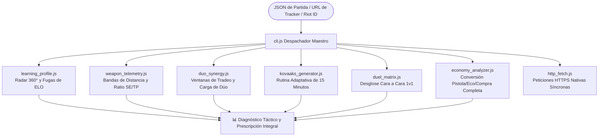

# 🎯 Motor de Telemetría Táctica y Coaching para Valorant (v3.0)

[](https://playvalorant.com/)
[](https://nodejs.org/)
[](package.json)
[](LICENSE)
[](opencode_tester.js)
[](test_suite.js)
[](README.md)

> **Motor de telemetría competitiva de alta precisión, radar autodiagnóstico de 5 pilares, analizador de bandas de distancia (0–50m) y generador adaptativo de rutinas de Kovaaks de 15 minutos. Cero dependencias externas.**

Leer en otros idiomas: **[English (README.md)](README.md)**.

---

## 🧭 ¿Por qué Valorant Analytics?

La mayoría de páginas de estadísticas solo muestran números crudos: K/D, porcentaje de headshots y tasa de victoria. No te dicen **por qué** se perdieron las rondas ni **dónde** se fugan los puntos de rango (ELO).

**Valorant Analytics** reconstruye la partida a nivel de rondas y micro-duelos para ofrecer coaching táctico accionable:
1. **Impacto Real vs Bajas Basura:** Mide el daño medio por ronda (ADR) y la apertura de duelos ($FK/FD$), eliminando el espejismo de bajas conseguidas cuando la ronda ya está perdida.
2. **Telemetría de Distancia:** Desglosa los enfrentamientos a corta distancia ($0-15\text{m}$), media ($15-30\text{m}$) y larga ($30-50\text{m}$) para detectar caídas de precisión de armas.
3. **Disciplina de Ráfaga vs Disparo Único ($SE/TP$):** Identifica el abuso del spray en situaciones desfavorables ($SE/TP > 1.8$) y prescribe rutinas de Kovaaks adaptadas.
4. **Sinergia Táctica de Dúo:** Audita la sincronía con tu compañero, el tiempo de tradeo y el balance de carga de bajas.
5. **Privacidad y Cero Dependencia de la Nube:** Ejecución 100% local sin servidores intermedios ni librerías npm pesadas. Permite calibrar perfiles privados de forma instantánea sin conexión (`cli.js calibrate`).

---

## 🚀 Modos de Uso (Matriz de Accesibilidad)

Diseñado para cualquier jugador o desarrollador:

| Perfil de Usuario | Modo de Operación | ¿Requiere Terminal? | ¿IA de Pago? | Cómo Empezar |
| :--- | :--- | :---: | :---: | :--- |
| **Jugador Convencional** | **Modo Texto (Zero-Tool)** | ❌ No | ❌ Gratis | Copia [`standalone_prompt.md`](standalone_prompt.md) y pégalo en ChatGPT o DeepSeek. |
| **Desarrollador / Competidor** | **Master CLI (Node.js Nativo)** | ✅ Sí | ❌ Gratis | Clona este repositorio y corre `node cli.js match <archivo>`. |
| **Usuario Avanzado de IA** | **Skill Agéntica (`SKILL.md`)** | ✅ Sí | Según agente | Cárgalo en Google Antigravity, Open Code o Claude Code. |

---

## ⚡ Master CLI: Despachador Universal

No necesitas memorizar nombres de scripts individuales. El despachador maestro `cli.js` orquesta todas las funciones:

```bash
# 1. Autodiagnóstico 360° y Detección de Fugas de ELO
node cli.js match examples/sample_match.json "TenZ#0001"

# 2. Telemetría de Armas, Zonas de Impacto y Bandas de Distancia (0-15m, 15-30m, 30-50m)
node cli.js weapons examples/sample_match.json "TenZ#0001"

# 3. Auditoría de Sinergia de Dúo y Tradeos (Balance de carga y roles)
node cli.js duo examples/sample_match.json "TenZ#0001" "Chronicle#0001"

# 4. Rutina Adaptativa de 15 Minutos en Kovaaks (Alineada a tus fallos de la partida)
node cli.js aim examples/sample_match.json "TenZ#0001"

# 5. Matriz de Duelos Directos 1v1 contra cada agente enemigo
node cli.js duels examples/sample_match.json "TenZ#0001"

# 6. Enlaces Normalizados Multi-Plataforma (Tracker / OP.GG / VLR)
node cli.js profile "Derke#0001"

# 7. Calibración Instantánea Zero-Cloud (Para perfiles privados o modo offline)
node cli.js calibrate "TenZ#0001" "Radiant" "Duelist"
```

---

## 📊 Ejemplo de Salida: Diagnóstico 360° y Coaching

```text
========================================================================
⚡ VALORANT ANALYTICS: UNIVERSAL COMPETITIVE ENGINE (V3.0)
========================================================================
🎯 DIAGNÓSTICO 360°: TenZ#0001 (Iso - Radiant) | Mapa: Lotus
------------------------------------------------------------------------
📊 RADAR DE RENDIMIENTO COMPETITIVO:
  • Precisión Mecánica (HS% / First-Bullet): 92 / 100 [HS: 38.2%]
  • Macrogame & Control de Espacio (KAST):   84 / 100 [KAST: 78.3%]
  • Duelos de Apertura (First Blood / Entry): 88 / 100 [FK/FD: 2.33]
  • Disciplina Económica (Loadout Ratio):    90 / 100 [Win en Full-Buy: 68%]
  • Compostura en Clutch (1v1 / 1v2):        82 / 100 [Conversión: 33%]
------------------------------------------------------------------------
⚠️ FUGAS DE ELO IDENTIFICADAS:
  1. Sobre-asomo sin cobertura en rondas 5v3 (Ronda 7, 14).
  2. Micro-spray innecesario a más de 30m en lugar de ráfagas cortas de 2 balas.
💡 REGLA DE COGNICIÓN INMEDIATA:
  "Juega el tiempo tras plantar; no busques la última baja si la spike está controlada."
========================================================================
```

---

## 🏗️ Arquitectura de Motores



### Detalle de Módulos

| Módulo | Responsabilidad Principal | Valor Concreto |
| :--- | :--- | :--- |
| **`learning_profile.js`** | Radar de 5 pilares (Puntería, Macro, Aperturas, Economía, Clutch). | Identifica rondas en las que se regaló la ventaja numérica. |
| **`weapon_telemetry.js`** | Zonas de impacto (H/B/L) y bandas ($0-15\text{m}$, $15-30\text{m}$, $30-50\text{m}$). | Calcula la disciplina de ráfagas ($SE/TP$) y prescribe ajustes de mira. |
| **`duo_synergy.js`** | Ventanas de tradeo, solapamiento de roles y balance de bajas. | Resuelve debates en dúos midiendo la eficiencia objetiva del re-frag. |
| **`kovaaks_generator.js`** | Rutina de 15 minutos en Voltaic/AimLab según los fallos de la partida. | Corrige el déficit mecánico exacto (micro-corrección o tracking). |
| **`duel_matrix.js`** | Balance neto 1v1 contra cada agente del equipo contrario. | Evalúa el MMR oculto al medir el rendimiento contra rangos superiores. |
| **`economy_analyzer.js`** | Tasa de victoria en rondas Pistola, Eco, Semi-Buy y Full-Buy. | Elimina compras intermedias que rompen los ciclos de economía del equipo. |
| **`http_fetch.js`** | Canal de peticiones HTTPS nativas con cabeceras de navegador. | Evita bloqueos WAF de Cloudflare sin depender de paquetes npm externos. |

---

## 🔬 Verificación Determinista y Suites de Pruebas

El código está respaldado por aserciones deterministas reales. Cero pruebas placebo; cero simulaciones donde hay datos concretos.

```bash
# Ejecutar la suite determinista de 18 pruebas
node test_suite.js

# Ejecutar el arnés autónomo para agentes Open Code / DeepSeek
node opencode_tester.js
```

### Resultados de la Auditoría

```text
========================================================================
🤖 OPEN CODE / DEEPSEEK TESTER & AUDIT HARNESS
Puntuación Global: 100 / 100 | Estado: ✅ EXCELENCIA VERIFICADA
========================================================================
📁 1. AUDITORÍA ESTÁTICA DE ARCHIVOS (30 / 30 pts):
  ✓ [PASS] SKILL.md, README.md, LICENSE, test_suite.js, etc. (17 archivos)

⚡ 2. AUDITORÍA DE EJECUCIÓN EN TIEMPO REAL (70 / 70 pts):
  ✅ learning_profile.js      : PASS (Exit 0)
  ✅ duo_synergy.js           : PASS (Exit 0)
  ✅ duel_matrix.js           : PASS (Exit 0)
  ✅ economy_analyzer.js      : PASS (Exit 0)
  ✅ kovaaks_generator.js     : PASS (Exit 0)
  ✅ weapon_telemetry.js      : PASS (Exit 0)
  ✅ cli.js (weapons)         : PASS (Exit 0)
  ✅ cli.js (calibrate)       : PASS (Exit 0)
  ✅ test_suite.js            : PASS (Exit 0) [18/18 PASS]
========================================================================
```

---

## 📈 Estándares de Referencia (Nivel Inmortal / Radiante)

| Métrica | Promedio Competitivo (Plata/Oro) | Estándar de Élite (Inmortal / Radiante) | Interpretación Táctica |
| :--- | :---: | :---: | :--- |
| **ADR** | 125 – 140 | **180 – 240+** | Daño entregado por ronda sin importar quién se lleva la baja final. |
| **ACS** | 190 – 210 | **280 – 380+** | Impacto general en la ronda, bajas de apertura y rondas ganadas. |
| **HS %** | 16% – 22% | **35% – 50%+** | Colocación de mira y disciplina del primer disparo. |
| **FK / FD** | 0.9 – 1.1 | **Ratio 2.0+** | Éxito en aperturas; mide la efectividad de los duelistas al entrar a sitio. |
| **KAST %** | 65% – 70% | **78% – 88%+** | Porcentaje de rondas con Baja, Asistencia, Supervivencia o Tradeo. |
| **Ratio SE / TP** | > 2.2 (Mucho spray) | **< 1.0 (Tap/Burst)** | Eficiencia de ráfaga vs toque. Un ratio alto delata pánico mecánico. |

---

## 🔒 Privacidad y Soberanía

* **Cero Almacenamiento en la Nube:** Tus estadísticas y datos de partida se procesan en la memoria de tu máquina.
* **Sin Recolección de Telemetría:** Cero peticiones de rastreo, analíticas ocultas o registro de actividad.
* **Listo para Operar Offline:** Sin paquetes npm de terceros. Funciona sobre Node.js estándar (v18+).

---

## 📄 Licencia

MIT © [Acourd](https://github.com/Acourd). De código abierto para jugadores competitivos, analistas y desarrolladores.
