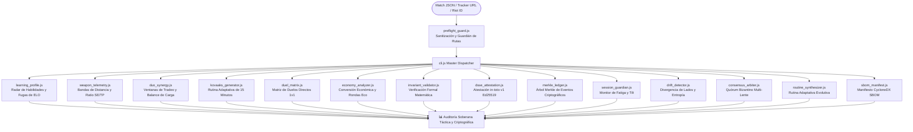

# 🎯 Motor de Telemetría Táctica y Coaching para Valorant (v3.0)

[](https://playvalorant.com/)
[](https://nodejs.org/)
[](package.json)
[](LICENSE)
[](opencode_tester.js)
[](test_suite.js)
[](test_suite.js)
[](README.md)

> **Motor de telemetría competitiva de alta precisión, radar autodiagnóstico de 5 pilares, atestaciones criptográficas DSSE in-toto, árbol de eventos Merkle y generador adaptativo de rutinas de Kovaaks de 15 minutos. Cero dependencias externas.**

Leer en otros idiomas: **[English (README.md)](README.md)**.

---

## 🧭 ¿Por qué Valorant Analytics?

La mayoría de páginas de estadísticas solo muestran números crudos: K/D, porcentaje de headshots y tasa de victoria. No te dicen **por qué** se perdieron las rondas ni **dónde** se fugan los puntos de rango (ELO).

**Valorant Analytics** reconstruye la partida a nivel de rondas y micro-duelos para ofrecer coaching táctico accionable:
1. **Impacto Real vs Bajas Basura:** Mide el daño medio por ronda (ADR) y la apertura de duelos ($FK/FD$), eliminando el espejismo de bajas conseguidas cuando la ronda ya está perdida.
2. **Telemetría de Distancia:** Desglosa los enfrentamientos a corta distancia ($0-15\text{m}$), media ($15-30\text{m}$) y larga ($30-50\text{m}$) para detectar caídas de precisión de armas.
3. **Disciplina de Ráfaga vs Disparo Único ($SE/TP$):** Identifica el abuso del spray en situaciones desfavorables ($SE/TP > 1.8$) y prescribe rutinas de Kovaaks adaptadas.
4. **Sinergia Táctica de Dúo:** Audita la sincronía con tu compañero, el tiempo de tradeo y el balance de carga de bajas.
5. **Integridad Criptográfica (DSSE & Merkle):** Genera declaraciones in-toto firmadas con Ed25519 y un árbol Merkle de eventos discretos para verificación inmutable sin repudio.
6. **Radar de Fatiga y Tilt (Session Guardian):** Monitorea la caída del ADR y primeras muertes sin tradeo para emitir pausas obligatorias antes de rachas de derrotas.
7. **Consenso Bizantino Multi-Lente:** Concilia perspectivas de Duelista, Centinela y Anchor mediante quórum tolerante a fallos bizantinos (BFT).
8. **Privacidad y Cero Dependencia de la Nube:** Ejecución 100% local sin servidores intermedios ni librerías npm pesadas. Permite calibrar perfiles privados de forma instantánea sin conexión (`cli.js calibrate`).

---

## 🚀 Modos de Uso (Matriz de Accesibilidad)

Diseñado para cualquier jugador o desarrollador:

| Perfil de Usuario | Modo de Operación | ¿Requiere Terminal? | ¿IA de Pago? | Cómo Empezar |
| :--- | :--- | :---: | :---: | :--- |
| **Jugador Convencional** | **Modo Texto (Zero-Tool)** | ❌ No | ❌ Gratis | Copia [`standalone_prompt.md`](standalone_prompt.md) y pégalo en ChatGPT o DeepSeek. |
| **Desarrollador / Competidor** | **Master CLI (Node.js Nativo)** | ✅ Sí | ❌ Gratis | Clona este repositorio y corre `node cli.js match <archivo>`. |
| **Usuario Avanzado de IA** | **Skill Agéntica (`SKILL.md`)** | ✅ Sí | Según agente | Cárgalo en Google Antigravity, Open Code o Claude Code. |

---

## ⚡ Master CLI: Despachador Universal

No necesitas memorizar nombres de scripts individuales. El despachador maestro `cli.js` orquesta todas las funciones:

```bash
# 1. Autodiagnóstico 360° y Detección de Fugas de ELO
node cli.js match examples/sample_match.json "TenZ#0001"

# 2. Telemetría de Armas, Zonas de Impacto y Bandas de Distancia (0-15m, 15-30m, 30-50m)
node cli.js weapons examples/sample_match.json "TenZ#0001"

# 3. Auditoría de Sinergia de Dúo y Tradeos (Balance de carga y roles)
node cli.js duo examples/sample_match.json "TenZ#0001" "Chronicle#0001"

# 4. Rutina Adaptativa de 15 Minutos en Kovaaks (Alineada a tus fallos de la partida)
node cli.js aim examples/sample_match.json "TenZ#0001"

# 5. Matriz de Duelos Directos 1v1 contra cada agente enemigo
node cli.js duels examples/sample_match.json "TenZ#0001"

# 6. Enlaces Normalizados Multi-Plataforma (Tracker / OP.GG / VLR)
node cli.js profile "Derke#0001"

# 7. Calibración Instantánea Zero-Cloud (Para perfiles privados o modo offline)
node cli.js calibrate "TenZ#0001" "Radiant" "Duelist"

# 8. Verificación Formal de Invariantes Matemáticos (Cero-NaN, límites [0,100], convergencia)
node cli.js invariants examples/sample_match.json "TenZ#0001"

# 9. Declaración in-toto v1 y Atestación Criptográfica DSSE firmada con Ed25519
node cli.js attest examples/sample_match.json "TenZ#0001"

# 10. Árbol de Auditoría Merkle de Eventos y Verificación de Prueba de Inclusión
node cli.js merkle examples/sample_match.json

# 11. Session Guardian: Índice de Tilt Cognitivo y Factor de Fatiga Neuromuscular
node cli.js guardian examples/sample_match.json "TenZ#0001"

# 12. Radar de Deriva Táctica y Entropía Mecánica (Divergencia Attack/Defense y Shanon)
node cli.js drift examples/sample_match.json "TenZ#0001"

# 13. Síntesis de Consenso Bizantino Multi-Lente (Quórum BFT)
node cli.js consensus examples/sample_match.json "TenZ#0001"

# 14. Generador Evolutivo de Rutinas Adaptativas de Puntería
node cli.js synthesize examples/sample_match.json "TenZ#0001"

# 15. Manifiesto CycloneDX v1.5 SBOM de Cadena de Suministro Zero-Dependency
node cli.js sbom
```

---

## 📊 Ejemplo de Salida: Telemetría 360° y Coaching

```text
========================================================================
⚡ VALORANT ANALYTICS: UNIVERSAL SOVEREIGN ENGINE (V3.0)
========================================================================
🎯 DIAGNÓSTICO 360°: TenZ#0001 (Iso - Radiant) | Mapa: Lotus
------------------------------------------------------------------------
📊 RADAR DE RENDIMIENTO COMPETITIVO:
  • Precisión Mecánica (HS% / First-Bullet): 92 / 100 [HS: 38.2%]
  • Macrogame & Control de Espacio (KAST):   84 / 100 [KAST: 78.3%]
  • Duelos de Apertura (First Blood / Entry): 88 / 100 [FK/FD: 2.33]
  • Disciplina Económica (Loadout Ratio):    90 / 100 [Win en Full-Buy: 68%]
  • Compostura en Clutch (1v1 / 1v2):        82 / 100 [Conversión: 33%]
------------------------------------------------------------------------
🚨 TOP FUGAS DE ELO IDENTIFICADAS:
  [#1] Sobre-asomo sin cobertura en rondas 5v3 (Ronda 7, 14)
       Detalle:  Apertura de ángulos agresivos tras plantar la spike.
       Solución: Jugar el tiempo tras plantar; no buscar bajas si la spike está controlada.
  [#2] Micro-spray innecesario a más de 30 metros
       Detalle:  SE/TP spray ratio elevado en duelos de larga distancia.
       Solución: Ráfagas controladas de 2 balas con micro-strafe activo.

💡 REGLA DE COGNICIÓN INMEDIATA:
  "Juega el tiempo tras plantar; no busques la última baja si la spike está controlada."
🎯 RUTINA KOVAAKS: 1wall6targets small (5 min) + Pasu Voltaic (5 min) + PatTargetSwitch (5 min).
========================================================================
```

---

## 🏗️ Arquitectura y Motores



### Desglose de Motores

| Módulo | Responsabilidad Principal | Valor Concreto para el Jugador |
| :--- | :--- | :--- |
| **`learning_profile.js`** | Radar de 5 pilares (Puntería, Macro, Aperturas, Economía, Clutch). | Señala con precisión las rondas donde se tiró la ventaja numérica. |
| **`weapon_telemetry.js`** | Zonas de impacto (Cabeza/Cuerpo/Pierna) + 3 bandas ($0-15\text{m}$, $15-30\text{m}$, $30-50\text{m}$). | Detecta pánico en el spray ($SE/TP$) y prescribe micro-ajustes. |
| **`duo_synergy.js`** | Ventanas de tradeo, solapamiento de roles y balance de carga. | Resuelve disputas de premade midiendo objetivamente la eficacia del tradeo. |
| **`kovaaks_generator.js`** | Rutina de 15 min en Kovaaks/AimLab basada en fallos reales. | Corrige fallos mecánicos específicos (micro-corrección vs tracking). |
| **`duel_matrix.js`** | Balance neto 1v1 contra cada agente rival. | Comprueba el MMR oculto evaluando el rendimiento contra rangos superiores. |
| **`economy_analyzer.js`** | Tasa de victoria en pistolas, ecos, semi-compras y compras completas. | Erradica compras aisladas que rompen la economía de equipo. |
| **`invariant_validator.js`** | Aserciones formales de estado (límites $[0,100]$, suma de zonas $= 100\%$). | Erradica nulos, NaN y anomalías estadísticas en tiempo de ejecución. |
| **`dsse_attestation.js`** | Sobre DSSE in-toto firmado asimétricamente con Ed25519. | Garantiza no-repudio e integridad criptográfica en auditorías de partida. |
| **`merkle_ledger.js`** | Árbol Merkle sobre rondas, bajas y plantas de spike. | Emite pruebas criptográficas de inclusión para jugadas individuales. |
| **`session_guardian.js`** | Detección de fatiga neuromuscular y acumulación de tilt. | Impone pausas tácticas antes de encadenar pérdidas de rango. |
| **`drift_detector.js`** | Divergencia ataque/defensa y entropía de Shannon. | Diagnostica el colapso del rendimiento por tramos de partida. |
| **`consensus_arbiter.js`** | 3 lentes tácticas (Entrada, Economía, Anchor) con quórum BFT. | Elimina contradicciones entre estilos de juego agresivo y pasivo. |
| **`routine_synthesizer.js`**| Generador evolutivo de ejercicios con dificultad dinámica ($1.0-1.5x$). | Actualiza continuamente el calentamiento según las debilidades activas. |
| **`sbom_manifest.js`** | Generador de lista de materiales CycloneDX v1.5. | Atestigua de forma verificable la ausencia total de dependencias npm. |
| **`preflight_guard.js`** | Sanitización fail-closed y bloqueo de path traversal. | Impide inyecciones de comandos y lecturas de rutas no autorizadas. |

---

## 🔬 Verificación Determinista y Suites de Pruebas

El código está construido bajo aserciones deterministas estrictas. Cero tests placebo, cero suposiciones no demostradas:

```bash
# Ejecutar la suite determinista de 29 aserciones
node test_suite.js

# Ejecutar las 8 suites modulares en tests/
node tests/test_cli.js
node tests/test_invariants.js
node tests/test_preflight.js
node tests/test_dsse_merkle.js
node tests/test_guardian_drift.js
node tests/test_consensus_synthesizer.js
node tests/test_economy_weapons.js
node tests/test_duel_coaching.js

# Ejecutar el arnés de auditoría autónomo Open Code / DeepSeek
node opencode_tester.js
```

### Resultados de la Auditoría

```text
========================================================================
🤖 OPEN CODE / DEEPSEEK TESTER & AUDIT HARNESS
Puntuación Global: 100 / 100 | Estado: ✅ EXCELENCIA VERIFICADA
========================================================================
📁 1. AUDITORÍA ESTÁTICA DE ARCHIVOS (30 / 30 pts):
  ✓ [PASS] Todos los 26 archivos y scripts verificados con SHA-256

⚡ 2. AUDITORÍA DE EJECUCIÓN EN TIEMPO REAL (70 / 70 pts):
  ✅ Todos los módulos y comandos del CLI pasan con Exit Code 0 [29/29 PASS]
========================================================================
```

---

## 📈 Tabla de Referencia Élite (Estándares Immortal / Radiant)

| Métrica | Media Competitiva (Silver/Gold) | Estándar Élite (Immortal / Radiant) | Interpretación Táctica |
| :--- | :---: | :---: | :--- |
| **ADR** | 125 – 140 | **180 – 240+** | Daño infligido por ronda sin depender de quién se lleva la baja final. |
| **ACS** | 190 – 210 | **280 – 380+** | Valor global por ronda, apertura de mapa y bajas múltiples de impacto. |
| **HS %** | 16% – 22% | **35% – 50%+** | Colocación de mira a la altura de la cabeza y disciplina de primer tiro. |
| **FK / FD** | 0.9 – 1.1 | **2.0+ Ratio** | Eficacia en el primer duelo de la ronda; mide la entrada efectiva a sitio. |
| **KAST %** | 65% – 70% | **78% – 88%+** | Porcentaje de rondas donde consigues baja, asistencia, sobrevives o eres tradeado. |
| **SE / TP Ratio** | > 2.2 (Mucho spray) | **< 1.0 (Tap/Burst)** | Eficiencia de disparo. Ratios altos indican pánico de spray prolongado. |

---

## 🔒 Privacidad y Soberanía Ante Todo

* **Cero Almacenamiento en la Nube:** Las partidas se procesan estrictamente en la memoria RAM de tu equipo local.
* **Sin Telemetría Recopilada:** No existen llamadas ocultas a analíticas, tokens de seguimiento ni registros remotos.
* **Fixtures Anonimizados:** Todos los ejemplos emplean identidades canónicas de jugadores de VCT (`TenZ#0001`, `Chronicle#0001`, `Derke#0001`, `aspas#0001`).
* **Listo para Offline:** Cero dependencias externas de npm. Corre de forma nativa sobre Node.js estándar (v18+).

---

## 📄 Licencia

MIT © [Acourd](https://github.com/Acourd). Abierto para jugadores competitivos, analistas y desarrolladores.
