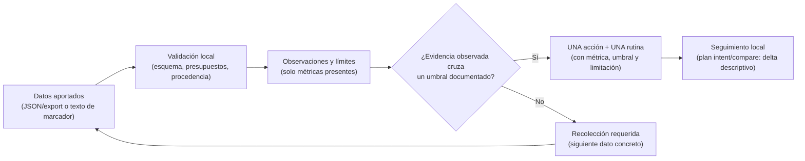

<div align="center">

# ⚡ VALORANT ANALYTICS

### Telemetría Competitiva Local · Diagnóstico Descriptivo 360° · Motor de Puntería Adaptativo

[](https://playvalorant.com/)
[](https://nodejs.org/)
[-38BDF8.svg?style=for-the-badge&logo=codeforces&logoColor=white)](package.json)
[](test_suite.js)
[](opencode_tester.js)
[](LICENSE)

<p align="center">
  <b>Beta técnica de autoanálisis local post-partida: trabaja con datos que aportas explícitamente.</b><br>
  Produce observaciones descriptivas con límites visibles, una acción priorizada (y su rutina) solo cuando existe evidencia observada, y un seguimiento local que compara métricas compatibles. No mide MMR interno, talento, rango merecido, causalidad ni mejora, y no sustituye a un coach humano.
</p>

[Tres Formas de Empezar](#-tres-formas-de-empezar) • [Estado y límites de valor](#-estado-actual-y-límites-de-valor) • [Comparativa](#-el-problema-con-los-rastreadores-convencionales) • [Flujo real](#-arquitectura-del-flujo-de-análisis) • [Importar de Tracker](#-importar-una-partida-desde-texto-descargado) • [Diagnóstico en Acción](#-diagnóstico-en-acción) • [Comandos CLI](#-guía-de-comandos-principales) • [Gemini Gems & GPTs](#-soporte-para-gemini-gems-y-custom-gpts) • [English](README.en.md)

</div>

---

## ◈ Estado actual y límites de valor

**Qué es hoy:** una **beta técnica de autoanálisis local post-partida**. Trabaja con **datos que aportas explícitamente** (JSON/export o texto de marcador) y produce observaciones descriptivas, límites visibles y, solo si existe evidencia observada, una acción priorizada con su rutina. **No es una plataforma de importación automática de perfiles**: no consulta Tracker.gg ni OP.GG, no lee caché, cookies o sesiones del navegador, no interpreta capturas (OCR no implementado) y no accede a la API de Riot. Riot RSO es una **posibilidad futura opcional** para telemetría autenticada, nunca un requisito ni una funcionalidad disponible hoy.

| Nivel de entrada | Qué puedes esperar | Qué NO se deriva |
|---|---|---|
| Agregados (marcador o stats de resumen) | Observaciones descriptivas de las métricas presentes y, si una cruza su umbral documentado, **una** acción mecánica limitada con su rutina | Causas, condiciones de ronda, conclusiones tácticas |
| Eventos por ronda (JSON normalizado) | Métricas adicionales observables por ronda (daño, kills, economía) | Aperturas/tradeo sin marcas temporales |
| Timestamps, posición o marcas de trade | Requisito para cualquier lectura de aperturas o tradeo | Nada si faltan: se declara la limitación |
| Datos insuficientes | Plan de recolección con el siguiente dato concreto | Diagnóstico inventado, puntajes decorativos |

**Qué no mide:** MMR interno, talento, rango merecido, causalidad ni mejora; **no reemplaza a un coach humano**. Una variación entre dos partidas es descriptiva y puede ser ruido.

---

## ◈ El Problema con los Rastreadores Convencionales

La mayoría de rastreadores web públicos solo suman cifras acumuladas al final de la partida: bajas totales, muertes y un porcentaje genérico de tiros a la cabeza. Este motor, con datos locales, trabaja sobre los mismos agregados: **sin eventos con contexto temporal y fuente verificada, ninguno de los dos atribuye causas tácticas; ambos se limitan a describir.**

| Dimensión Analítica | Rastreadores Públicos | Motor Valorant Analytics | Qué aporta realmente (con límites) |
| :--- | :---: | :---: | :--- |
| **Bajas de Apertura (FK/FD)** | 🔴 K/D plano sin contexto | 🟡 **ADR observado + Ratio $FK/FD$ (agregados)** | Cuenta FK (bajas de apertura) y FD (muertes de apertura) observadas; con agregados no separa causas tácticas ni bajas clave. |
| **Mecánica de Disparo** | 🔴 % Headshot global | 🟢 **Ratio $SE/TP$ (zonas observadas)** | Mide sobre-spray con zonas observadas; la distancia es n/d sin posiciones (no se infiere). |
| **Sinergia en Pareja** | 🔴 Inexistente | 🟢 **Auditoría de Dúo (agregados)** | Describe balance de bajas y carga; NO mide ventanas de tradeo sin eventos con contexto temporal. |
| **Economía de Rondas** | 🔴 Total gastado global | 🟢 **Conversión por Buy-Tiers (Eco/Semi/Full)** | Describe la conversión por buy-tier con umbrales observados; no atribuye causas ni proyecta mejora. |
| **Salud de Cuenta** | 🔴 Solo rango visual | 🟡 **Señal heurística de MMR & estimación de rango** | Plantea una HIPÓTESIS (no verificada) de posible anclaje y una estimación orientativa de rango. No mide el MMR interno de Riot ni el talento real. |
| **Entrada de datos** | 🔴 Cosecha de caché / Tracker | 🟢 **JSON/export o texto aportados por ti** | Sin cosecha de caché ni descarga automática: la entrada la aportas explícitamente; la vía autorizada (Riot RSO) está pendiente de credenciales. |

---

## ◈ Arquitectura del Flujo de Análisis

El flujo real es local y condicionado por la evidencia (sin Tracker, sin caché, sin OCR de capturas):



No consulta Tracker.gg ni OP.GG, no lee caché/cookies/sesiones del navegador y no interpreta capturas (OCR no implementado). Riot RSO es una **posibilidad futura opcional**, no un requisito ni una funcionalidad disponible hoy.

---

## ◈ Tres Formas de Empezar

Tres caminos de entrada manual; elige el que menos fricción añada a los datos que ya tienes:

### 🔹 Opción 1: Modo Directo sin Terminal (Vía Asistente Web o Gem)
> **Ideal si buscas un análisis conversacional inmediato desde un JSON/export o el texto de tu marcador (OCR de capturas: no implementado).**

1. Abre la especificación lista para usar: 👉 [**`standalone_prompt.md`**](standalone_prompt.md)
2. Copia todo su contenido y pégalo en tu asistente de IA favorito (**ChatGPT, Claude, Gemini o DeepSeek-R1**), o configúralo como un **Gem de Google Gemini** o **Custom GPT de OpenAI**.
3. Pega el texto de tu marcador o aporta un JSON/export (OCR de capturas NO implementado; Tracker no soportado).

### ⚡ Opción 2: Modo Local en Terminal (Despachador Maestro `cli.js`)
> **Análisis 100% local con datos aportados por ti: JSON/export o texto de marcador. Sin descarga automática de Tracker/OP.GG, sin caché del navegador y sin OCR de capturas (no implementado).**

```bash
# 1. Clona el repositorio
git clone https://github.com/Acourd/valorant-analytics.git
cd valorant-analytics

# 2. PLAN para la siguiente partida (flujo recomendado: aportar → entender → una acción → medir)
node cli.js plan examples/sample_match.json "TenZ#0001"

# 3. Ingesta de tu propio marcador (JSON/export o texto; sin red)
node cli.js parse mi_marcador.txt "TenZ#0001"

# 4. Lectura amplia y rutina (cuando el plan las habilite)
node cli.js match examples/sample_match.json "TenZ#0001"
node cli.js aim examples/sample_match.json "TenZ#0001"

# 5. Herramientas técnicas de integridad (no son coaching): DSSE, Merkle, MPC, Wasm, invariantes
node cli.js --advanced --help
```

### 🤖 Opción 3: Modo Agente Autónomo (Antigravity / Claude Code / OpenCode)
> **Para desarrolladores y usuarios avanzados que integran habilidades agénticas.**

- Carga la carpeta como skill activa enlazando [`SKILL.md`](SKILL.md).
- Más de 16 comandos; las herramientas criptográficas/de integridad (DSSE, Merkle, invariantes) son de **verificación técnica**, no coaching, y viven en el modo avanzado (`--advanced --help`).

---

## ◈ Diagnóstico en Acción

Ejemplo ilustrativo (fixture local; no es telemetría real ni una salida validada empíricamente):

```text
========================================================================
⚡ VALORANT ANALYTICS: UNIVERSAL SOVEREIGN ENGINE (V4.5)
========================================================================
🎯 DIAGNÓSTICO 360°: TenZ#0001 (Iso - Platinum 1) | Mapa: Lotus
------------------------------------------------------------------------
📊 RADAR DE RENDIMIENTO COMPETITIVO (5 PILARES):
  • Precisión Mecánica (HS%)  : [█████████░]  86 / 100  (29.9% Headshots | Benchmark: 25-35%)
  • Participación Útil (KAST) : [████████░░]  82 / 100  (74.0% de rondas útiles)
  • Apertura de Duelos (FK/FD): [█████████░]  94 / 100  (54.0% de First Bloods | 4 FK / 1 FD)
  • Disciplina Económica      : [█████████░]  90 / 100  (68.0% win en compra completa)
  • Compostura en Clutch      : [████████░░]  80 / 100  (33.3% conversión en situaciones 1v2)

🔎 OBSERVACIONES POR RONDA (datos normalizados; NO verificados; NO se atribuyen causas):
  • R3 [damage] dmg 165 (H1/B2/L0)
  • R9 [economy] spent 2600
  (Fugas/causas omitidas: requieren fuente verificada + regla + resultado + contexto.)

📌 LÍMITES DE ESTE EJEMPLO: procedencia `normalized_input`; sin timestamps, posición ni marcas
   de trade, por lo que no se emiten reglas de timing, tradeo o posicionamiento.

🎯 RUTINA SUGERIDA (solo si la evidencia observada cruza su umbral; ~15 min, orientativa):
  ┌───────────────────────────┬──────────┬──────────────────────┬─────────────────────────────────────┐
  │ Bloque de Entrenamiento   │ Duración │ Escenario KovaaK's   │ Objetivo Biomecánico                │
  ├───────────────────────────┼──────────┼──────────────────────┼─────────────────────────────────────┤
  │ 1. Calibración Primer Tiro│ 5 min    │ Pasu Small Reload    │ Calibración de parada en la cabeza  │
  │ 2. Limpieza de Ángulos    │ 5 min    │ 1wall6targets small  │ Confirmación de 1-tap en movimiento │
  │ 3. Control Horizontal     │ 5 min    │ Thin Aiming Long     │ Suavidad sin temblor en tracking    │
  └───────────────────────────┴──────────┴──────────────────────┴─────────────────────────────────────┘
========================================================================
```

---

## ◈ Guía de Comandos Principales

El despachador maestro `cli.js` provee acceso unificado a todas las capacidades del sistema:

| Comando | Sintaxis | Descripción |
| :--- | :--- | :--- |
| **Diagnóstico 360°** | `node cli.js match [partida.json] <jugador>` | Describe los pilares con métricas observadas; las fugas atribuibles requieren fuente verificada. |
| **Rutina de Puntería** | `node cli.js aim [partida.json] <jugador>` | Propone, solo si existe evidencia observada, una playlist de aim orientativa (~15 min) en KovaaK's / Aim Lab. |
| **Telemetría de Armas** | `node cli.js weapons [partida.json] <jugador>` | Mide zonas observadas (Head/Body/Leg) y ratio SE/TP; la distancia es n/d: no se infiere sin posiciones. |
| **Economía & Buy Tiers**| `node cli.js economy [partida.json] <jugador>` | Desglosa winrate, K/D y ADR en rondas Pistol, Eco, Semi-Buy y Full-Buy. |
| **Coaching Introspectivo**| `node cli.js coaching [partida.json] <jugador>` | Identifica duelos de máxima fricción y prescribe recursos tácticos de YouTube. |
| **Auditoría de Dúo** | `node cli.js duo [partida.json] [p1] [p2]` | Describe balance de bajas y carga (sin ventanas de timing; heurística de boost no validada). |
| **Matriz de Duelos 1v1** | `node cli.js duels [partida.json] [jugador]` | Desglosa los duelos directos cara a cara contra cada agente rival. |
| **Simulación Offline** | `node cli.js calibrate [jugador] [rango] [rol]` | SIMULACIÓN con valores ilustrativos (sin datos del jugador ni telemetría real). |
| **Auditoría de Carrera** | `node cli.js career <perfil.json>` | Desglosa horas competitivas vs casuales y cronología de hitos por rango. |
| **Señal Heurística de MMR** | `node cli.js diagnose <perfil.json>` | Señala un patrón compatible con posible anclaje (hipótesis NO verificada) y una estimación orientativa de rango. No mide el MMR interno. |
| **Ingesta Resiliente** | `node cli.js parse <archivo_o_texto> [jugador]` | Procesa JSON/export, volcados de texto o cualquier archivo existente (extensión opcional). Sin red. |
| **Invariantes Matemáticos**| `node cli.js invariants [partida.json] [jugador]` | Verificación formal de cotas numéricas [0, 100] y convergencia de zonas (100%). |
| **Atestación Cripto** | `node cli.js attest [partida.json] [jugador]` | Genera y valida un sobre DSSE in-toto firmado con Ed25519. |
| **Árbol Merkle** | `node cli.js merkle [partida.json]` | Construye el árbol Merkle de eventos discretos y emite pruebas de inclusión. |
| **Session Guardian** | `node cli.js guardian [partida.json] [jugador]` | Monitorea fatiga neuromuscular acumulada y calcula índice de tilt cognitivo. |
| **Deriva Táctica** | `node cli.js drift [partida.json] [jugador]` | Calcula divergencia de lado y entropía de Shannon en la distribución de rondas. |
| **Consenso Multi-Lente** | `node cli.js consensus [partida.json] [jugador]` | Arbitraje determinista entre 3 lentes locales (NO es BFT real) para síntesis de rendimiento. |
| **Manifiesto SBOM** | `node cli.js sbom` | Genera el manifiesto SBOM en formato CycloneDX v1.5 con 0 dependencias externas. |

---

## 🗂️ Seguimiento local de planes (privacidad y retención)

El ciclo completo es local: **crear plan → marcar intento → aportar otra partida → comparar → siguiente paso**.

```bash
node cli.js plan mi_marcador.txt "TenZ#0001"          # crea el plan y lo registra (planId determinista)
node cli.js plan list                                  # planes activos
node cli.js plan show <planId>                         # detalle: métrica, umbral, acción, rutina, bitácora
node cli.js plan intent <planId> "nota breve"          # marca la acción como intentada (≤200 caracteres)
node cli.js plan compare <planId> otra_partida.txt     # comparación honesta (solo métricas comparables)
node cli.js plan close <planId> | cancel <planId>      # cierra o cancela
node cli.js plan export --pseudonymized                # exportación explícita a stdout (jugador pseudonimizado)
```

**Privacidad y retención:** el historial vive en `VALORANT_PLANS_DIR` (por defecto `<cache>/plans`): un JSON por plan (0600 en POSIX, escritura atómica) con jugador, referencia+digest de la entrada, procedencia, fecha, métrica/valor/umbral/limitación, acción, rutina, siguiente dato, estado y bitácora breve. **No** se guardan credenciales, tokens ni datos de terceros. **Perímetro del directorio** validado componente a componente (raíz incluida): nada de symlinks en ningún nivel, rutas que no sean directorio, propietario ajeno ni escritura de grupo/otros (0770/0777 no admisibles); únicos exentos, los hijos directos de la raíz (`/tmp`, `/var`…), que son raíces de sistema. La creación es escalonada, el directorio final exige 0700 del usuario actual y la cadena se revalida antes del `rename`. La lectura abre por descriptor (`O_NOFOLLOW` donde existe) y verifica identidad y metadatos (sustitución ⇒ fail-closed); en Windows es best-effort documentado. Límite de 500 planes; los datos `synthetic_demo` no se persisten ni se comparan.

**Comparación honesta:** exige mismo jugador exacto, métrica observada y procedencia compatible. Estados: `MEDICION_COMPARABLE`, `DATOS_INSUFICIENTES`, `NO_COMPARABLE`, `SIMULACION_DEMO`; con `--json`, un único objeto. El resultado es un **delta descriptivo** con limitación explícita: una variación entre dos partidas no demuestra efecto de la rutina, mejora, MMR, rango ni talento.

**Perfiles de salida (misma evidencia, distinta presentación):** `--profile player` (breve), `--profile coach` (evidencia, límites y preguntas sugeridas) y `--profile analyst` (JSON estructurado). No cambian la política de evidencia.

## 🧱 Presupuestos de recursos y contrato de esquema

Las entradas no confiables se procesan con **límites explícitos**. `VA_BUDGET_*` (p. ej. `VA_BUDGET_MAX_PLAYERS=32`) **solo puede REDUCIR** un límite: los valores inválidos (texto, NaN, Infinity, no enteros, ≤0) o los intentos de ampliación por encima del máximo seguro compilado **fallan cerrado** con `RESOURCE_BUDGET_EXCEEDED`. No existe escape de entorno para ampliar límites. Al exceder un límite se falla cerrado con un código estable y **sin análisis parcial**:

| Presupuesto | Valor por defecto | Motivo |
|---|---|---|
| Tamaño de archivo | 5 MiB | un export normal pesa <1 MiB; margen amplio sin OOM |
| Longitud de texto | 200 000 caracteres | un marcador pegado enorme ronda decenas de KB |
| Profundidad JSON | 64 niveles | `JSON.parse` no limita profundidad |
| Jugadores | 64 | una partida tiene 10-20 |
| Rondas | 200 | un competitivo largo ronda 40 |
| Eventos | 100 000 | agregados por ronda de partidas largas |
| Elementos por arreglo | 20 000 | listas de daño/kills reales |
| Tiempo de proceso | 30 s | **corte cooperativo** en fases y bucles instrumentados (`sample()`); el runtime JS no puede preemptar código síncrono, así que no es un corte total garantizado |
| Workers concurrentes | 16 | estrés interno sin saturar runners |

Códigos: `INPUT_TOO_LARGE` (archivo/texto), `SCHEMA_LIMIT_EXCEEDED` (profundidad, jugadores, rondas, eventos, arreglos), `RESOURCE_BUDGET_EXCEEDED` (tiempo, workers). Con `--json`, la salida es **un único objeto** `{ ok:false, exitCode, error:{ code, message, details } }`.

**Esquema versionado:** `schemaVersion: 1` es el contrato actual. Ubicaciones canónicas: `data.metadata.schemaVersion` (normalizado) y `matchInfo.schemaVersion` (Riot). En Riot, `payload.schemaVersion` en la raíz **solo** se acepta si coincide con la canónica; si la canónica falta, la versión de raíz **se rechaza** (`SCHEMA_UNSUPPORTED`), nunca se admite como `supported`. Ausente ⇒ **legado limitado** (se procesa lo observable y se declara); incompatible en cualquier ubicación admitida o **discrepancia** ⇒ `SCHEMA_UNSUPPORTED`. Los campos desconocidos se ignoran con seguridad y se **declaran en el diagnóstico**, sin elevar la procedencia.

**Modalidad de estrés (fuera de la matriz normal):** `node tests/stress_dsse.js` ejecuta rondas acotadas de registro concurrente en el keystore DSSE con invariante completo en cada ronda y sin reintentos silenciosos (el primer error queda en logs). CI la corre en un job separado (`VA_STRESS_ROUNDS=3`).

## 📥 Entrada mínima útil (qué puedes aportar)

No necesitas telemetría imposible. El flujo `plan` funciona por niveles:

| Nivel | Qué aportas | Qué habilita |
|---|---|---|
| 1. Texto/marcador | Pegas el texto del marcador o un JSON/export con funciones y K/D/A, ACS, ADR y HS% | Observaciones descriptivas y, si una métrica cruza su umbral documentado, **una** acción mecánica con su rutina |
| 2. Eventos por ronda | Segmentos `player-round` / `player-round-damage` | Zonas head/body/leg y ratio spray/tap observados. El tradeo/aperturas requieren además marcas de trade, posición o timestamp |
| 3. Fuente verificada | Riot RSO con atestación (credenciales pendientes) | Única vía que podría habilitar causas/fugas atribuibles; hoy no disponible |

Si tu entrada no alcanza, `plan` no falla de forma genérica: indica el **siguiente dato más pequeño y concreto** (p. ej. "HS% del marcador" o "eventos de ronda con marcas de trade").

## 📄 Importar una partida desde texto descargado

También puedes evitar plantillas: guarda la página de una partida como texto y el importador local detecta el formato.

1. Abre la partida en Tracker en tu navegador.
2. Guarda la página como `.txt` (Ctrl+S → “Solo texto” / “Página de texto”).
3. Ejecuta el análisis con tu Riot ID exacto:

```bash
node cli.js plan  "partida-tracker.txt" "Nombre#TAG"   # plan + registro local
node cli.js parse "partida-tracker.txt" "Nombre#TAG"   # ingesta descriptiva
node cli.js match "partida-tracker.txt" "Nombre#TAG"   # diagnóstico 360°
```

- **Solo origen manual de texto:** el archivo lo aportas tú. El producto **no inicia sesión, no consulta Tracker, no lee caché del navegador y no evita Cloudflare**; tampoco hace scraping ni usa APIs de Tracker.
- **Detección explícita con fallo cerrado:** si el bloque `Scoreboard` está incompleto o el formato cambió, termina con `TRACKER_TEXT_FORMAT_UNSUPPORTED` y **no** cae al parser genérico ni emite análisis parcial.
- **Extrae solo lo observado** (agente, rango, ACS, K/D/A, +/-, K/D, DDΔ, ADR, HS%, KAST, FK, FD, MK, mapa, modo, marcador, fecha, duración y rango medio) y deja `null` + declarado lo ausente; no inventa rondas, posiciones, economía, trades, duelos ni eventos.
- **Procedencia `normalized_input`** con digest local del texto, nunca `verified_source`. Aplican los mismos límites: no atribuye causas, no mide MMR interno/talento/rango merecido ni demuestra mejora.
- Con `--json`, la salida indica `sourceFormat: tracker_text_export`, campos extraídos/ausentes y límites declarados.

## ◈ Soporte para Gemini Gems y Custom GPTs

Si utilizas **Google Gemini (Gems)** o **OpenAI (Custom GPTs)**, el archivo [`standalone_prompt.md`](standalone_prompt.md) está optimizado para trabajar solo con datos que aportas (JSON/export, texto o `.txt` guardado de Tracker):

- **System prompt con tags XML** (`<system_role>`, `<vision_and_input_protocol>`, `<output_specification>`) y guardas anti-alucinación.
- **Ingesta multi-formato local:** JSON/export, texto de marcador o `.txt` guardado de Tracker; OCR de capturas no implementado. Versión completa en inglés: [`standalone_prompt.en.md`](standalone_prompt.en.md).

---

## ◈ Privacidad y Especificaciones de Ingeniería

- **100% Local y Confidencial:** todo el análisis se ejecuta en tu equipo; nada sale de tu máquina. No hay llamadas de red salvo que en el futuro actives Riot RSO con credenciales propias.
- **Sin red por defecto:** el análisis es local. No se cosecha la caché del navegador ni se consulta Tracker.gg. La entrada es un JSON/export, texto de marcador o un `.txt` guardado manualmente desde Tracker (origen manual de texto: sin sesión, sin scraping y sin integración automática); el OCR de capturas no está implementado.
- **Zero Dependencias NPM:** Diseñado exclusivamente sobre las librerías estándar de Node.js (`fs`, `path`, `zlib`, `crypto`, `child_process`). Cero descargas externas.
- **Compatibilidad Multiplataforma:** Probado en CI sobre Windows, macOS y Linux (Node 18/20/22/24); sin garantía de resultados.
- **Garantía Determinista:** 211 pruebas automatizadas y suites modulares verificadas con Exit Code 0 (`node run_all_tests.js`) y auditoría semántica de propiedades fail-closed, sin puntuación promocional (`node opencode_tester.js`).
- **Contrato CLI:** salida humana y `--json`; códigos `0`/`1`/`2` documentados (resultado válido / entrada inválida / evidencia insuficiente); ningún comando selecciona un jugador en silencio.

---

## ◈ Alcance y Límites (Honestidad de Datos)

Este proyecto **describe** lo que la telemetría local permite observar; no certifica hechos sobre el emparejamiento interno de Riot ni sobre el jugador.

- **MMR / "MMR Drag":** la salida es una **hipótesis heurística no verificada** a partir de agregados (partidas, KD, ACS, DDΔ, HS, horas). El proyecto **no accede al MMR interno** ni a las ganancias/pérdidas de RR por partida, por lo que no puede determinar ni demostrar un anclaje algorítmico. Toda conclusión de este tipo queda marcada como `hipotesis_no_verificada`.
- **Talento vs esfuerzo:** es una **etiqueta descriptiva** de patrones de impacto/volumen, no una medición de talento. Los agregados no separan talento de esfuerzo ni prueban causalidad.
- **Rango merecido:** la "estimación de rango" es una **cota orientativa** derivada de umbrales heurísticos, no un rango real.
- **Validación pendiente:** el motor aún no se ha validado con telemetría real ni con una muestra de jugadores. Hasta entonces, ninguna salida debe presentarse como diagnóstico concluyente.
- **`verified_source` (frente #1):** la única fuente autorizada para VALORANT es la **API oficial de Riot (production key + Riot Sign-On)**; las claves personales/developer no tienen acceso. El adaptador (`scripts/riot_source.js`) exige token Riot, host en allowlist, `matchId` verificable y una atestación Ed25519 **verificada contra el trust store del operador** (`RIOT_ATTESTATION_TRUST`), que **no se acepta como argumento**; la firma la produce la clave privada del **ingestor autorizado** (`RIOT_ATTESTATION_KEY`, 0600 fuera del repo), nunca una clave del llamador. Una firma local acredita **procedencia del ingestor**, no que Riot emitiera criptográficamente el contenido. Sin credenciales aprobadas, `verified_source` es inalcanzable y todo queda como `normalized_input`. Credenciales Riot: **pendientes de solicitud**.
- **Fugas de ELO (aprendizaje 360°):** solo se emiten como atribuibles con fuente verificada; con datos locales se muestran observaciones descriptivas, no una auditoría forense de la cuenta.

---

## ◈ Licencia

Distribuido bajo la [Licencia MIT](LICENSE). Código libre para uso personal, competitivo y formativo.
