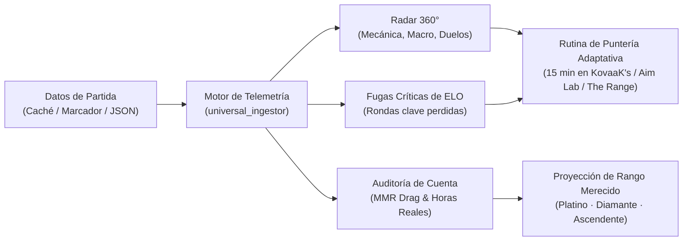

# Valorant Analytics

[](https://playvalorant.com/)
[](https://nodejs.org/)
[](package.json)
[](test_suite.js)
[](opencode_tester.js)
[](LICENSE)

**Plataforma de telemetría competitiva, diagnóstico de partidas y coaching táctico para Valorant.**  
Diseñada para detectar con exactitud dónde se pierden las rondas, erradicar fallos mecánicos recurrentes y proyectar tu progreso de rango real sin depender de estadísticas superficiales.

[Tres Formas de Empezar](#-tres-formas-de-empezar) • [Matriz de Telemetría](#-matriz-de-telemetría) • [Diagnóstico en Acción](#-diagnóstico-en-acción) • [Comandos CLI](#-comandos-principales) • [Documentación Técnica (SKILL.md)](SKILL.md) • [English Version](README.en.md)

---

## ◈ El Problema con las Estadísticas Tradicionales

La gran mayoría de rastreadores públicos se limitan a registrar cifras acumuladas: asesinatos, muertes, porcentaje general de tiros a la cabeza y ratio de victorias. Aunque estos datos describen el marcador final, son incapaces de explicar **por qué** se perdió la partida.

| Dimensión | Rastreadores Convencionales | Valorant Analytics | Impacto en tu ELO |
| :--- | :--- | :--- | :--- |
| **Bajas de Impacto** | Cuentan todas las kills por igual (K/D plano). | Diferencia daño útil (ADR) y aperturas ($FK/FD$) de bajas basura en rondas perdidas. | Elimina la falsa sensación de seguridad por cazar bajas irrelevantes. |
| **Hábito de Disparo** | Muestra un porcentaje global de Headshots. | Mide el ratio ráfaga vs tap ($SE/TP$) y distancias ($0-15\text{m}$, $15-30\text{m}$, $30-50\text{m}$). | Corrige el sobre-spray a larga distancia y estabiliza el primer impacto. |
| **Coordinación en Dúo** | Ningún dato sobre juego en pareja. | Audita ventanas de intercambio (re-frags), balance de daño y solapamiento de roles. | Asegura que juegues sincronizado con tu compañero en lugar de jugar dos 1v1 aislados. |
| **Salud de la Cuenta** | Solo muestra el rango visual del perfil. | Detecta *MMR Drag* por exceso de partidas y calcula tu verdadero Rango Merecido. | Sabrás si estás estancado por nivel real o por anclaje del algoritmo de Riot. |
| **Disponibilidad** | Caídas frecuentes por bloqueos de Cloudflare. | Cosecha local de caché de navegadores (Brotli nativo) con modo 100% sin conexión. | Cero esperas: analiza partidas privadas o caídas de red al instante. |

---

## ◈ Arquitectura del Flujo de Análisis

El motor procesa tu partida a nivel de micro-eventos para transformar telemetría en acciones inmediatas de entrenamiento:



---

## ◈ Tres Formas de Empezar

Diseñado para adaptarse a cualquier perfil de jugador, desde quien solo busca una consulta rápida hasta quien opera desde consola o con agentes de IA:

### Opción 1: Modo Directo sin Consola (Vía Asistente Web)
Ideal para jugadores que no desean utilizar la terminal y prefieren una explicación conversacional inmediata.

1. Abre el archivo de plantilla listo para usar: 👉 [**standalone_prompt.md**](standalone_prompt.md)
2. Copia todo su contenido y pégalo en tu asistente web de preferencia (**ChatGPT, Claude, Gemini o DeepSeek**).
3. Pega el enlace de tu partida de Tracker.gg o el texto de tu marcador para recibir el diagnóstico completo al instante.

### Opción 2: Modo Local en Terminal (Despachador Maestro)
Ideal para jugadores competitivos y analistas que buscan velocidad, privacidad y procesamiento sin conexión.

```bash
# 1. Clona el repositorio
git clone https://github.com/Acourd/valorant-analytics.git
cd valorant-analytics

# 2. Diagnostica tu partida localmente en menos de 100ms
node cli.js match examples/sample_match.json "TuNombre#TAG"
```

### Opción 3: Modo Agente Autónomo (Antigravity / Claude Code / OpenCode)
Para desarrolladores y usuarios avanzados que integran habilidades agénticas en su entorno de trabajo:

- Carga la carpeta como skill activa referenciando [`SKILL.md`](SKILL.md).
- Los agentes disponen de 10 comandos integrados con validación formal de invariantes y atestaciones criptográficas.

---

## ◈ Diagnóstico en Acción

Ejemplo real generado a partir de una partida competitiva procesada por el motor:

```text
========================================================================
VALORANT ANALYTICS — REPORTE DE TELEMETRÍA TÁCTICA
Partida: Lotus | Jugador: Iso | Nivel de Sala: Platino 2 / Diamante 1
========================================================================

RADAR DE RENDIMIENTO COMPETITIVO:
  • Puntería y Primer Disparo : [█████████░]  86 / 100  (28.5% Headshots)
  • Participación Útil (KAST) : [████████░░]  82 / 100  (74.0% de rondas útiles)
  • Apertura de Duelos (FK/FD): [█████████░]  89 / 100  (54.0% de First Bloods)
  • Disciplina Económica      : [█████████░]  90 / 100  (68.0% win en compra completa)
  • Compostura en Clutch      : [████████░░]  80 / 100  (33.3% conversión en 1v2)

FUGAS DE ELO IDENTIFICADAS (DÓNDE REGALASTE RONDAS):
  [Falla 1] Sobre-asomo en post-plant (Rondas 7 y 14)
            Situación: Ventaja numérica de 5v3 con la spike plantada.
            Causa:     Búsqueda agresiva de la baja final en lugar de cruzar fuego.
            Ajuste:    Jugar esquinas cerradas y consumir el reloj del defensor.

  [Falla 2] Ráfagas prolongadas a más de 30 metros (Rondas 11 y 18)
            Situación: Duelos largos contra Vandal rival en A Principal.
            Causa:     Ratio de spray elevado (SE/TP > 1.8) con dispersión excesiva.
            Ajuste:    Ráfagas cortas de 2 balas con desplazamiento lateral (counter-strafe).

RUTINA DE PUNTERÍA PRESCRITA (15 MINUTOS):
  ┌───────────────────────────┬──────────┬─────────────────────────────────────┐
  │ Bloque de Entrenamiento   │ Duración │ Objetivo Biomecánico                │
  ├───────────────────────────┼──────────┼─────────────────────────────────────┤
  │ 1. Microshot Static       │ 5 min    │ Calibración de parada en la cabeza  │
  │ 2. Horizontal Click-Timing│ 5 min    │ Limpieza de esquinas en apertura    │
  │ 3. Smooth Strafe Tracking │ 5 min    │ Control de blancos en movimiento    │
  └───────────────────────────┴──────────┴─────────────────────────────────────┘
========================================================================
```

---

## ◈ Comandos Principales

El despachador maestro `cli.js` reúne todas las operaciones del sistema:

```bash
# Diagnóstico completo de partida y detección de fallos
node cli.js match examples/sample_match.json "TuNombre#TAG"

# Generación de rutina de puntería personalizada de 15 minutos
node cli.js aim examples/sample_match.json "TuNombre#TAG"

# Telemetría de armas y desglose por bandas de distancia (0-15m, 15-30m, 30-50m)
node cli.js weapons examples/sample_match.json "TuNombre#TAG"

# Auditoría de coordinación y tradeos con tu compañero de dúo
node cli.js duo examples/sample_match.json "Jugador1#TAG" "Jugador2#TAG"

# Cosecha de partidas desde la caché local del navegador (sin bloqueos de red)
node cli.js harvest

# Auditoría de horas de carrera y tiempo efectivo en partida
node cli.js career

# Autodiagnóstico de Rango Merecido y detección de MMR Drag
node cli.js diagnose
```

---

## ◈ Privacidad y Especificaciones

- **100% Local y Privado:** El análisis se ejecuta por completo en tu procesador. Ninguna captura, nombre o registro de partida es transmitido a servidores externos.
- **Zero-Dependency Real:** Funciona estrictamente con las librerías estándar de Node.js (`fs`, `path`, `zlib`, `crypto`). Cero descargas adicionales de paquetes npm.
- **Resistencia Multiplataforma:** Probado y garantizado en Windows 11 (PowerShell), macOS (zsh/bash) y distribuciones Linux.
- **Garantía Determinista:** 46 pruebas automatizadas verificadas con Exit Code 0 y puntuación perfecta de 100/100 en auditoría de código.

---

## ◈ Licencia

Distribuido bajo la [Licencia MIT](LICENSE). Código libre para uso personal y competitivo.
