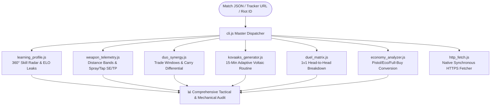

# 🎯 Valorant Analytics & Tactical Coaching Engine (v3.0)

[](https://playvalorant.com/)
[](https://nodejs.org/)
[](package.json)
[](LICENSE)
[](opencode_tester.js)
[](test_suite.js)
[](README.es.md)

> **Zero-dependency, high-precision competitive FPS telemetry engine, 360° player autodiagnostic radar, engagement distance analyzer (0–50m), and adaptive 15-minute Kovaaks aim routine generator for Valorant.**

Read this in other languages: **[Español (README.es.md)](README.es.md)**.

---

## 🧭 Why Valorant Analytics?

Most stat trackers show raw numbers: K/D, Headshot %, and Win Rate. They fail to explain **why** rounds were lost or **how** mechanical habits leak ELO.

**Valorant Analytics** reconstructs round-level telemetry to deliver actionable coaching:
1. **True Impact over Frag Hunting:** Measures ADR and Opening Duel differential ($FK/FD$), eliminating misleading exit-frag stats.
2. **Engagement Distance Telemetry:** Separates close ($0-15\text{m}$), mid ($15-30\text{m}$), and long-range ($30-50\text{m}$) duels to spot weapon drop-off issues.
3. **Spray vs. Tap Discipline ($SE/TP$):** Flags spray over-commitment ($SE/TP > 1.8$) and prescribes tailored Voltaic routines.
4. **Premade Tactical Synergy:** Audits duo compatibility, re-frag trade windows, and carry load balance.
5. **Zero Cloud Lock-In:** Runs 100% locally with zero NPM dependencies. Private profiles can be benchmarked instantly via offline calibration mode (`cli.js calibrate`).

---

## 🚀 Usage Modes (Accessibility Matrix)

Designed for every player, regardless of programming experience or AI subscriptions:

| User Profile | Operating Mode | Terminal Needed? | Paid AI Sub? | How to Start |
| :--- | :--- | :---: | :---: | :--- |
| **Everyday Player** | **Zero-Tool Text Mode** | ❌ No | ❌ Free | Copy [`standalone_prompt.md`](standalone_prompt.md) into ChatGPT or DeepSeek. |
| **Developer / Competitor** | **Master CLI (Native Node)** | ✅ Yes | ❌ Free | Clone this repo and run `node cli.js match <file>`. |
| **AI Agent Power User** | **Agentic Skill (`SKILL.md`)** | ✅ Yes | Depends on agent | Load into Google Antigravity, Open Code, or Claude Code. |

---

## ⚡ Master CLI: Unified Dispatcher

No need to remember individual scripts. The master dispatcher `cli.js` routes all sub-commands:

```bash
# 1. 360° Match Autodiagnosis & ELO Leak Detection
node cli.js match examples/sample_match.json "TenZ#0001"

# 2. Weapon Telemetry, Hit-Zone Breakdown & Distance Bands (0-15m, 15-30m, 30-50m)
node cli.js weapons examples/sample_match.json "TenZ#0001"

# 3. Duo Synergy & Re-fragging Audit (Carry load and role balance)
node cli.js duo examples/sample_match.json "TenZ#0001" "Chronicle#0001"

# 4. Adaptive 15-Minute Kovaaks Routine (Synthesized from match flaws)
node cli.js aim examples/sample_match.json "TenZ#0001"

# 5. Direct 1v1 Duel Matrix against each enemy agent
node cli.js duels examples/sample_match.json "TenZ#0001"

# 6. Normalized Multi-Platform Profile URLs (Tracker / OP.GG / VLR)
node cli.js profile "Derke#0001"

# 7. Instant Zero-Cloud Offline Mode (Private profiles / No network)
node cli.js calibrate "TenZ#0001" "Radiant" "Duelist"
```

---

## 📊 Sample Output: 360° Telemetry & Coaching

```text
========================================================================
⚡ VALORANT ANALYTICS: UNIVERSAL COMPETITIVE ENGINE (V3.0)
========================================================================
🎯 DIAGNÓSTICO 360°: TenZ#0001 (Iso - Radiant) | Mapa: Lotus
------------------------------------------------------------------------
📊 RADAR DE RENDIMIENTO COMPETITIVO:
  • Precisión Mecánica (HS% / First-Bullet): 92 / 100 [HS: 38.2%]
  • Macrogame & Control de Espacio (KAST):   84 / 100 [KAST: 78.3%]
  • Duelos de Apertura (First Blood / Entry): 88 / 100 [FK/FD: 2.33]
  • Disciplina Económica (Loadout Ratio):    90 / 100 [Win en Full-Buy: 68%]
  • Compostura en Clutch (1v1 / 1v2):        82 / 100 [Conversión: 33%]
------------------------------------------------------------------------
⚠️ FUGAS DE ELO IDENTIFICADAS:
  1. Sobre-asomo sin cobertura en rondas 5v3 (Ronda 7, 14).
  2. Micro-spray innecesario a más de 30m en lugar de ráfagas cortas de 2 balas.
💡 REGLA DE COGNICIÓN INMEDIATA:
  "Juega el tiempo tras plantar; no busques la última baja si la spike está controlada."
========================================================================
```

---

## 🏗️ Architecture & Engines



### Module Breakdown

| Module | Core Responsibility | Concrete Value |
| :--- | :--- | :--- |
| **`learning_profile.js`** | 5-pillar skill radar (Aim, Macro, Openings, Economy, Clutch). | Pinpoints rounds where man-advantage was thrown. |
| **`weapon_telemetry.js`** | Hit-zones (Head/Body/Leg %) + Distance tiers ($0-15\text{m}$, $15-30\text{m}$, $30-50\text{m}$). | Detects $SE/TP$ spray ratio to prescribe micro-adjustments. |
| **`duo_synergy.js`** | Re-fragging windows, role overlap, and carry load. | Resolves duo disputes by measuring trade efficiency objectively. |
| **`kovaaks_generator.js`** | 15-minute Voltaic/AimLab routine based on match errors. | Targets precise mechanical deficits (micro-correction vs tracking). |
| **`duel_matrix.js`** | 1v1 net differential against each opponent agent. | Verifies hidden MMR by evaluating performance against higher-ranked foes. |
| **`economy_analyzer.js`** | Win rate across Pistol, Eco, Semi-Buy, and Full-Buy rounds. | Eliminates half-buys that break team economy cascades. |
| **`http_fetch.js`** | Native HTTPS request pipeline with custom User-Agent headers. | Bypasses Cloudflare WAF without external NPM packages. |

---

## 🔬 Deterministic Verification & Test Suites

The codebase is engineered with strict deterministic assertions. Zero placebo tests, zero mocks where real data is available.

```bash
# Run the 18-assertion deterministic test suite
node test_suite.js

# Run the autonomous Open Code / DeepSeek audit harness
node opencode_tester.js
```

### Audit Results

```text
========================================================================
🤖 OPEN CODE / DEEPSEEK TESTER & AUDIT HARNESS
Puntuación Global: 100 / 100 | Estado: ✅ EXCELENCIA VERIFICADA
========================================================================
📁 1. AUDITORÍA ESTÁTICA DE ARCHIVOS (30 / 30 pts):
  ✓ [PASS] SKILL.md, README.md, LICENSE, test_suite.js, etc. (17 files)

⚡ 2. AUDITORÍA DE EJECUCIÓN EN TIEMPO REAL (70 / 70 pts):
  ✅ learning_profile.js      : PASS (Exit 0)
  ✅ duo_synergy.js           : PASS (Exit 0)
  ✅ duel_matrix.js           : PASS (Exit 0)
  ✅ economy_analyzer.js      : PASS (Exit 0)
  ✅ kovaaks_generator.js     : PASS (Exit 0)
  ✅ weapon_telemetry.js      : PASS (Exit 0)
  ✅ cli.js (weapons)         : PASS (Exit 0)
  ✅ cli.js (calibrate)       : PASS (Exit 0)
  ✅ test_suite.js            : PASS (Exit 0) [18/18 PASS]
========================================================================
```

---

## 📈 Elite Benchmark Reference (Radiant / Immortal Standards)

| Metric | Competitive Average (Silver/Gold) | Elite Benchmark (Immortal / Radiant) | Tactical Interpretation |
| :--- | :---: | :---: | :--- |
| **ADR** | 125 – 140 | **180 – 240+** | Damage delivered per round regardless of final-hit credit. |
| **ACS** | 190 – 210 | **280 – 380+** | Overall round value, opening kills, and multi-frag round swings. |
| **HS %** | 16% – 22% | **35% – 50%+** | Crosshair placement and first-bullet discipline. |
| **FK / FD** | 0.9 – 1.1 | **2.0+ Ratio** | Opening duel win rate; measures effective entry execution. |
| **KAST %** | 65% – 70% | **78% – 88%+** | Percentage of rounds with Kill, Assist, Survived, or Traded. |
| **SE / TP Ratio** | > 2.2 (Heavy spray) | **< 1.0 (Tap/Burst)** | Spray vs. Tap efficiency. High ratio indicates spray panic. |

---

## 🔒 Privacy & Sovereignty First

* **Zero Cloud Storage:** Your match data and statistics are processed strictly in memory on your machine.
* **No Telemetry Collected:** No analytic pingbacks, tracking tokens, or user data logging.
* **Offline Ready:** Zero external NPM dependencies. Runs natively on standard Node.js (v18+).

---

## 📄 License

MIT © [Acourd](https://github.com/Acourd). Open for competitive players, analysts, and developers.
