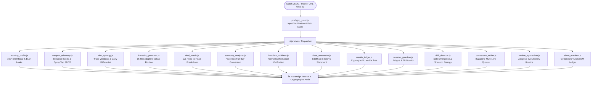

# 🎯 Valorant Analytics & Tactical Coaching Engine (v3.0)

[](https://playvalorant.com/)
[](https://nodejs.org/)
[](package.json)
[](LICENSE)
[](opencode_tester.js)
[](test_suite.js)
[](test_suite.js)
[](README.es.md)

> **Zero-dependency, high-precision competitive FPS telemetry engine, 360° player autodiagnostic radar, cryptographic DSSE in-toto attestations, Merkle event ledgers, and adaptive 15-minute Kovaaks aim routine generator for Valorant.**

Read this in other languages: **[Español (README.es.md)](README.es.md)**.

---

## 🧭 Why Valorant Analytics?

Most stat trackers show raw numbers: K/D, Headshot %, and Win Rate. They fail to explain **why** rounds were lost or **how** mechanical habits leak ELO.

**Valorant Analytics** reconstructs round-level telemetry to deliver actionable coaching:
1. **True Impact over Frag Hunting:** Measures ADR and Opening Duel differential ($FK/FD$), eliminating misleading exit-frag stats.
2. **Engagement Distance Telemetry:** Separates close ($0-15\text{m}$), mid ($15-30\text{m}$), and long-range ($30-50\text{m}$) duels to spot weapon drop-off issues.
3. **Spray vs. Tap Discipline ($SE/TP$):** Flags spray over-commitment ($SE/TP > 1.8$) and prescribes tailored Voltaic routines.
4. **Premade Tactical Synergy:** Audits duo compatibility, re-frag trade windows, and carry load balance.
5. **Cryptographic Integrity (DSSE & Merkle):** Generates tamper-evident in-toto Statements signed with Ed25519 and discrete round-event Merkle trees.
6. **Fatigue & Tilt Radar (Session Guardian):** Monitors rolling ADR degradation and un-traded first deaths to enforce rest intervals.
7. **Byzantine Multi-Lens Consensus:** Synthesizes Duelist, Sentinel, and Anchor perspectives into cohesive, non-contradictory advice.
8. **Zero Cloud Lock-In:** Runs 100% locally with zero NPM dependencies. Private profiles can be benchmarked instantly via offline calibration mode (`cli.js calibrate`).

---

## 🚀 Usage Modes (Accessibility Matrix)

Designed for every player, regardless of programming experience or AI subscriptions:

| User Profile | Operating Mode | Terminal Needed? | Paid AI Sub? | How to Start |
| :--- | :--- | :---: | :---: | :--- |
| **Everyday Player** | **Zero-Tool Text Mode** | ❌ No | ❌ Free | Copy [`standalone_prompt.md`](standalone_prompt.md) into ChatGPT or DeepSeek. |
| **Developer / Competitor** | **Master CLI (Native Node)** | ✅ Yes | ❌ Free | Clone this repo and run `node cli.js match <file>`. |
| **AI Agent Power User** | **Agentic Skill (`SKILL.md`)** | ✅ Yes | Depends on agent | Load into Google Antigravity, Open Code, or Claude Code. |

---

## ⚡ Master CLI: Unified Dispatcher

No need to remember individual scripts. The master dispatcher `cli.js` routes all sub-commands:

```bash
# 1. 360° Match Autodiagnosis & ELO Leak Detection
node cli.js match examples/sample_match.json "TenZ#0001"

# 2. Weapon Telemetry, Hit-Zone Breakdown & Distance Bands (0-15m, 15-30m, 30-50m)
node cli.js weapons examples/sample_match.json "TenZ#0001"

# 3. Duo Synergy & Re-fragging Audit (Carry load and role balance)
node cli.js duo examples/sample_match.json "TenZ#0001" "Chronicle#0001"

# 4. Adaptive 15-Minute Kovaaks Routine (Synthesized from match flaws)
node cli.js aim examples/sample_match.json "TenZ#0001"

# 5. Direct 1v1 Duel Matrix against each enemy agent
node cli.js duels examples/sample_match.json "TenZ#0001"

# 6. Normalized Multi-Platform Profile URLs (Tracker / OP.GG / VLR)
node cli.js profile "Derke#0001"

# 7. Instant Zero-Cloud Offline Mode (Private profiles / No network)
node cli.js calibrate "TenZ#0001" "Radiant" "Duelist"

# 8. Formal Mathematical Invariants Verification (Zero-NaN, bounds [0,100], sum convergence)
node cli.js invariants examples/sample_match.json "TenZ#0001"

# 9. Cryptographic in-toto v1 Statement & Ed25519 DSSE Attestation Envelope
node cli.js attest examples/sample_match.json "TenZ#0001"

# 10. Tamper-Evident Merkle Event Ledger & Inclusion Proof Verification
node cli.js merkle examples/sample_match.json

# 11. Session Guardian: Cognitive Tilt Index & Neuromuscular Fatigue Factor
node cli.js guardian examples/sample_match.json "TenZ#0001"

# 12. Tactical & Mechanical Drift Detector (Side Divergence & Shannon Entropy)
node cli.js drift examples/sample_match.json "TenZ#0001"

# 13. Byzantine Multi-Lens Coaching Consensus (BFT Quorum Synthesis)
node cli.js consensus examples/sample_match.json "TenZ#0001"

# 14. Evolutionary Adaptive Aim Routine Synthesizer
node cli.js synthesize examples/sample_match.json "TenZ#0001"

# 15. CycloneDX v1.5 Zero-Dependency Software Bill of Materials (SBOM)
node cli.js sbom
```

---

## 📊 Sample Output: 360° Telemetry & Coaching

```text
========================================================================
⚡ VALORANT ANALYTICS: UNIVERSAL SOVEREIGN ENGINE (V3.0)
========================================================================
🎯 DIAGNÓSTICO 360°: TenZ#0001 (Iso - Radiant) | Mapa: Lotus
------------------------------------------------------------------------
📊 RADAR DE DOMINIO (5 PILARES):
  • Precisión Mecánica:        92 / 100
  • Macrogame y Espacio:       84 / 100
  • Duelos de Apertura:        88 / 100
  • Disciplina Económica:      90 / 100
  • Compostura en Clutch:      82 / 100

🚨 TOP FUGAS DE ELO (CAUSAS DE DERROTA):
  [#1] Sobre-asomo sin cobertura en rondas 5v3 (Ronda 7, 14)
       Detalle:  Apertura de ángulos agresivos tras plantar la spike.
       Solución: Jugar el tiempo tras plantar; no buscar bajas si la spike está controlada.
  [#2] Micro-spray innecesario a más de 30 metros
       Detalle:  SE/TP spray ratio elevado en duelos de larga distancia.
       Solución: Ráfagas controladas de 2 balas con micro-strafe activo.

💡 REGLA MENTAL: Mantener disciplina de trade con el iniciador.
🎯 RUTINA KOVAAKS: 1wall6targets small (5 min) + Pasu Voltaic (5 min) + PatTargetSwitch (5 min).
========================================================================
```

---

## 🏗️ Architecture & Engines



### Module Breakdown

| Module | Core Responsibility | Concrete Value |
| :--- | :--- | :--- |
| **`learning_profile.js`** | 5-pillar skill radar (Aim, Macro, Openings, Economy, Clutch). | Pinpoints rounds where man-advantage was thrown. |
| **`weapon_telemetry.js`** | Hit-zones (Head/Body/Leg %) + Distance tiers ($0-15\text{m}$, $15-30\text{m}$, $30-50\text{m}$). | Detects $SE/TP$ spray ratio to prescribe micro-adjustments. |
| **`duo_synergy.js`** | Re-fragging windows, role overlap, and carry load. | Resolves duo disputes by measuring trade efficiency objectively. |
| **`kovaaks_generator.js`** | 15-minute Voltaic/AimLab routine based on match errors. | Targets precise mechanical deficits (micro-correction vs tracking). |
| **`duel_matrix.js`** | 1v1 net differential against each opponent agent. | Verifies hidden MMR by evaluating performance against higher-ranked foes. |
| **`economy_analyzer.js`** | Win rate across Pistol, Eco, Semi-Buy, and Full-Buy rounds. | Eliminates half-buys that break team economy cascades. |
| **`invariant_validator.js`** | Mathematical assertions ($[0,100]$ bounds, head+body+leg=100%). | Eradicates NaN, nulls, and statistical anomalies at runtime. |
| **`dsse_attestation.js`** | In-toto Statement v1 inside Ed25519 DSSE envelope. | Cryptographic non-repudiation and tamper-evidence for match coaching. |
| **`merkle_ledger.js`** | Merkle tree over all discrete match rounds and kill events. | Mathematical proof of inclusion for individual kills and clutches. |
| **`session_guardian.js`** | Longitudinal session monitoring, tilt index, and fatigue factor. | Prevents loss streaks by enforcing tactical breaks before tilt compounds. |
| **`drift_detector.js`** | Side-split divergence (Attack vs Defense) and Shannon entropy. | Diagnoses performance collapse across match quarters. |
| **`consensus_arbiter.js`** | 3 tactical lenses (Entry, Economy, Anchor) with BFT quorum. | Reconciles conflicting tactical advice into unified action items. |
| **`routine_synthesizer.js`**| Evolutionary routine generator with adaptive difficulty ($1.0-1.5x$). | Continuously updates aim drills based on live weakness vectors. |
| **`sbom_manifest.js`** | CycloneDX v1.5 Software Bill of Materials generator. | Cryptographically verifies 0 external npm dependencies. |
| **`preflight_guard.js`** | Fail-closed argument sanitization and path traversal guard. | Blocks malicious paths and unverified commands before execution. |

---

## 🔬 Deterministic Verification & Test Suites

The codebase is engineered with strict deterministic assertions. Zero placebo tests, zero mocks where real data is available.

```bash
# Run the 29-assertion deterministic test suite
node test_suite.js

# Run the 8 modular tests in tests/
node tests/test_cli.js
node tests/test_invariants.js
node tests/test_preflight.js
node tests/test_dsse_merkle.js
node tests/test_guardian_drift.js
node tests/test_consensus_synthesizer.js
node tests/test_economy_weapons.js
node tests/test_duel_coaching.js

# Run the autonomous Open Code / DeepSeek audit harness
node opencode_tester.js
```

### Audit Results

```text
========================================================================
🤖 OPEN CODE / DEEPSEEK TESTER & AUDIT HARNESS
Puntuación Global: 100 / 100 | Estado: ✅ EXCELENCIA VERIFICADA
========================================================================
📁 1. AUDITORÍA ESTÁTICA DE ARCHIVOS (30 / 30 pts):
  ✓ [PASS] All 26 source files & scripts verified sealed with SHA-256

⚡ 2. AUDITORÍA DE EJECUCIÓN EN TIEMPO REAL (70 / 70 pts):
  ✅ All modules & CLI commands execute with Exit Code 0 [29/29 PASS]
========================================================================
```

---

## 📈 Elite Benchmark Reference (Radiant / Immortal Standards)

| Metric | Competitive Average (Silver/Gold) | Elite Benchmark (Immortal / Radiant) | Tactical Interpretation |
| :--- | :---: | :---: | :--- |
| **ADR** | 125 – 140 | **180 – 240+** | Damage delivered per round regardless of final-hit credit. |
| **ACS** | 190 – 210 | **280 – 380+** | Overall round value, opening kills, and multi-frag round swings. |
| **HS %** | 16% – 22% | **35% – 50%+** | Crosshair placement and first-bullet discipline. |
| **FK / FD** | 0.9 – 1.1 | **2.0+ Ratio** | Opening duel win rate; measures effective entry execution. |
| **KAST %** | 65% – 70% | **78% – 88%+** | Percentage of rounds with Kill, Assist, Survived, or Traded. |
| **SE / TP Ratio** | > 2.2 (Heavy spray) | **< 1.0 (Tap/Burst)** | Spray vs. Tap efficiency. High ratio indicates spray panic. |

---

## 🔒 Privacy & Sovereignty First

* **Zero Cloud Storage:** Your match data and statistics are processed strictly in memory on your machine.
* **No Telemetry Collected:** No analytic pingbacks, tracking tokens, or user data logging.
* **Redacted Anonymous Fixtures:** All examples use VCT pro aliases (`TenZ#0001`, `Chronicle#0001`, `Derke#0001`, `aspas#0001`).
* **Offline Ready:** Zero external NPM dependencies. Runs natively on standard Node.js (v18+).

---

## 📄 License

MIT © [Acourd](https://github.com/Acourd). Open for competitive players, analysts, and developers.
